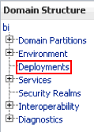
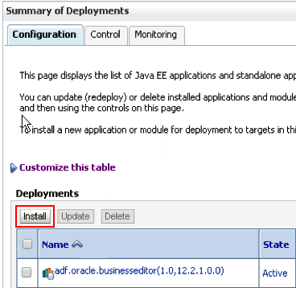
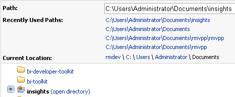
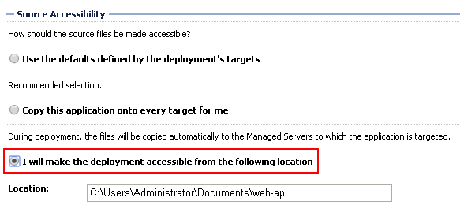
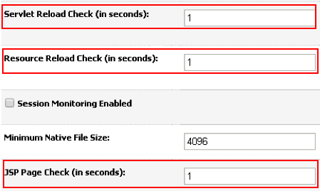

% Installation Guide

This guide shows you how to install the alternative front end. It will require you to have **administrator** access to OBIEE as well as access to the physical machine on which the server resides. You will also need to [download](https://github.com/RittmanMead/insights/releases) the source code from the GitHub release page. Both of the guides should be agnostic of Windows or Linux platforms.

At a high level, the installation is to deploy the code base as a web application and update some of the session management behaviour of the presentation service.

# Manual

1. Unzip the source code archive and rename the output directory to `web-api`. If necessary, move the directory to a desired location on the server and make a note of it.
2. Navigate to the WebLogic Console (`biserver:7001/console` on 11g, `biserver:9500/console` on 12c).
3. On the left side of the screen, navigate to **Deployments** under *Domain Structure*.



4. Click **Lock & Edit**.
5. In the deployment summary, click the **Install** button.



6. Navigate to the extracted directory in the next view, and it should be highlighted in bold and available for selection. Select it and click **Next**.



7. Choose **Install this directory as an application** and click **Next**.
8. Select to deploy the application on **All servers in the cluster**.
9. Under *Source Accessibility*, select **I will make this deployment available from the the following location** and make sure the path matches the code directory. Also ensure that the name of the deployment is **web-api** as files in the project will expect to reference this path once it is deployed.



10. Select **Yes, take me to the deployment's configuration screen** to go straight to the configuration page and hit **Finish**.
11. *Optional:* This step will allow the application to automatically update as soon as changes are made in the directory. This is recommended for development and test deployments where changes are made quickly. It is not necessary in production, but a deployment restart will then be required when making changes. Switch to the **Configuration** tab and change these three options to **1**:

* Servlet Reload Check
* Resource Reload Check
* JSP Page Check



12. Click **Save** at the top and accept the creation of `Plan.xml`.
13. On the left hand side of the screen, click **Activate Changes**.
14. Navigate back to the **Deployments** screen by using the link on the left hand side under *Domain Structure*.
15. Change to the **Control** tab and find your application, `web-api`. It should be in state *Prepared*. Click the **Start** button and choose **Servicing all requests** from the dropdown.
16. Find and open `instanceconfig.xml`.

	* On 11g this is in `$MW_HOME/instances/instance1/config/OracleBIPresentationServicesComponent/`.
	* On 12c it is in `$MW_HOME/user_projects/domains/bi/config/fmwconfig/biconfig/OBIPS`.

17. In order to make the app interoperable with vanilla OBIEE, the web API needs access to the `ORA_BIPS_NQID` cookie set by the Weblogic server. Add the following tags to the `Security` tag in the file.

```xml
<Security>
	<!-- Leave any other server tags as they are-->
	<HttpOnlyCookies>false</HttpOnlyCookies>
	<CookiePath>/</CookiePath>
</Security>
```

18. Restart the OBIEE presentation services.
19. Create a new file: `js/customConfig.js`. This doesn't require any content for Insights to work, but you can use it to update configuration parameters set in `config.js`. `config.js` will be overwitten with new versions of Insights obtained from Git, however `customConfig.ini` is unversioned so you will not lose your configuration changes after an update. Note that some updates will change configuration parameters and so you may need to make tweaks anyway.
20. You should now be able to access the new front end from `<server>:<port>/insights`. The default port for 11g is 9704. For 12c it is 9502. E.g: `http://rmdev:9502/insights`.
