% Plugin Development Tutorial

This guide will show you how to develop a custom plugin by explaining the process of implementing the actual pie chart visualisation used in the application.

# Pre-requisites

* RM Insights installed on a server, deployed and functioning.
* Access to the server running OBIEE and RM Insights, specifically the `insights` deployment directory, referred to as `/insights` from now on.
* Following WebLogic parameters set to 1 for the `insights` deployment (will prevent the need for restarts during development):
    * Servlet Reload Check
    * Resource Reload Check
    * JSP Page Check
* Have read the [documentation](developing-plugins.html)
* Google Chrome - has a great Developer Console that is extremely useful for debugging.
* Some familiarity with the RM Insights UI.
* Some familiarity with (or willingness to learn) HTML, JavaScript and D3.
* Approximately 1 hour.

File paths will be referred to in Linux (`/`) format, so switch to `/` if you are using a Windows server. The guide is written to be performed in the order of this document, so by all means skip ahead and read sections, but if you want the outcome to work properly, it's best to follow the guide in order.

# Create File

The plugins are all stored under `/insights/plugins` and each has a sub directory with a name equal to the *Plugin ID*. Create a new directory at `/insights/plugins/custom-pie` which will hold our code.

`template.js` is an example JavaScript file with the default structure of a plugin laid out. Copy and rename this file to `/custom-pie/custom-pie.js`.

# Plugin Structure

The parameters in the template should be modified to work for your new plugin. They all define objects which link the UI to the render function, so you should see this part of the file as the dialogue between the user and the developer. As a developer you can define properties to tell the user to give you the information you require, in the format that you want it.

## Global UI Parameters

At the top of the file (3-8) there are global parameters for the plugin. The `pluginName` variable must be set to `custom-pie` to keep everything consistent. The display names and description parameters are what the user will see in the UI. Finally the icon will be displayed with this plugin and is a reference ID to an icon from [FontAwesome](http://fontawesome.io/icons/).

Replace these definitions with the ones below for our custom pie chart.

```javascript
var pluginName = "custom-pie"
rmvpp.Plugins[pluginName] = {};
rmvpp.Plugins[pluginName].id = pluginName;
rmvpp.Plugins[pluginName].displayName = "Custom Pie Chart";
rmvpp.Plugins[pluginName].description = 'Pie chart visualisation used to display discrete information. Can hover over slices for tooltip information.';
rmvpp.Plugins[pluginName].icon = "pie-chart";
```

## Column Mapping

The next `columnMappingParameters` property (line 11) defines the **Column Map**, the object that links the columns chosen by the user to the visualisation that you're creating. Here it is important to think about what your visualisation will do and what the easiest way for your users to construct it might be. Pie charts are nice and simple in this regard, we have one attribute category by which we want to show a distribution of a single numeric field.

```javascript
rmvpp.Plugins[pluginName].columnMappingParameters = [
    {
        targetProperty:"category",
        formLabel:"Category",
        type: 'dim',
        required: true,
        desc: 'Attribute for each section in the pie.'
    },
    {
        targetProperty:"measure",
        formLabel:"Measure",
        type: 'fact',
        required: true,
        desc: 'Measure influencing the size of each slice.'
    }
];
```

This first parameter is the category, which will define how many sections we have and what labels they will be. `type` has been set to `dim` here, as it should request a dimension (non-numeric) attribute. `required` is also set, so the user is told that they need this column to run the visualisation. We don't need to specify `multiple`, as there can only be one column assigned here.

The second parameter is the measure, which will govern the size of each slice depending on the distribution by the category. This has similar properties as before, except we can set the type to `fact` as we want a numeric field in this section.

## Configuration

The `configurationParameters` property (line 29) defines the **Configuration** of the plugin. These are global parameters that are passed to the `render` function at run-time and allow customisation of the visualisation. Properties like colours and styles belong in this section.

Due to the UI's scaling functions, each plugin *must* have defined either:

* `width` **and** `height`
* `size`

As a general rule, rectangular layouts should use width and height, square layouts should use `size`. A pie chart is a circle, so the width and height are equal, as such we can use the *size* property.

```javascript
rmvpp.Plugins[pluginName].configurationParameters = [
    {
        targetProperty:"size",
        label: "Size",
        inputType: "textbox",
        inputOptions: {
            "subType" : "number",
            "defaultValue": 400
        },
        desc: 'Size of the pie chart in pixels.'
    }
];
```

This configuration parameter declares a size property, which has a textbox in the UI. The `subType` indicates that it should be for numbers, which will automatically prevent invalid data from being entered. A default value of 400 has been set.

There are many other types configuration parameters we could set, but for now we'll keep it simple.

## Actions and Reactions

The `actions` and `reactions` properties (lines 43-55) are for declaring interactivity. For now just keep this as the default and we will update them later.

# Rendering a Basic Chart

The `render` function (line 59) is the main function which should hold all of the code to create the visualisation. It is always passed the following arguments:

* `data` : Data from a BI query, formatted to use property names from the column map.
* `columnMap` : Column map, which has information about all the columns the user selected, mapped based on the object described [earlier](#column-mapping).
* `config` : Object with all of the [configuration](#configuration) settings specified by the user.
* `container` : [HTML DOM](http://www.w3schools.com/jsref/dom_obj_all.asp) element that you should render your visualisation in.
* `condFormats` : Object describing conditional formatting.

## Testing the Skeleton

Before we continue, let's see if we can set up a test case and run our plugin so far. We won't expect it to do anything, but the `console.log` line in the render function will show you the format of the objects you have to work with.

Open `/insights/app/states/visBuilder/index.html` and look at the header of the file (lines 55-122). These are all of the includes for the various plugins in the system. Add the following Javascript after the last plugin but before the Angular App definitions:

```javascript
<!-- Custom Pie Chart -->
<script src="/insights/plugins/custom-pie/custom-pie.js"></script>
```

Now when the application loads the editor, it should pick up your plugin. Using Chrome, open the [editor page](/insights//app/states/visBuilder/) and refresh the page with `CTRL+R`. Open the developer console using `CTRL+SHIFT+I`. Open the plugin drop-down and you should see your plugin as an available option.

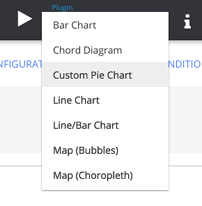

If the plugin is not there, and you see some errors in the console there is probably a syntax error somewhere in your JavaScript file that needs fixing.

Choose sensible attributes (dimension and measure) and drag them to corresponding sections of the column map and hit run. Hopefully you'll see something pop up in the console. These are the arguments passed to the render function that we'll be manipulating when rendering the plugin. The Chrome developer console is a fantastic way of inspecting Javascript objects and provides a very easy-to-read interface for JS structures.

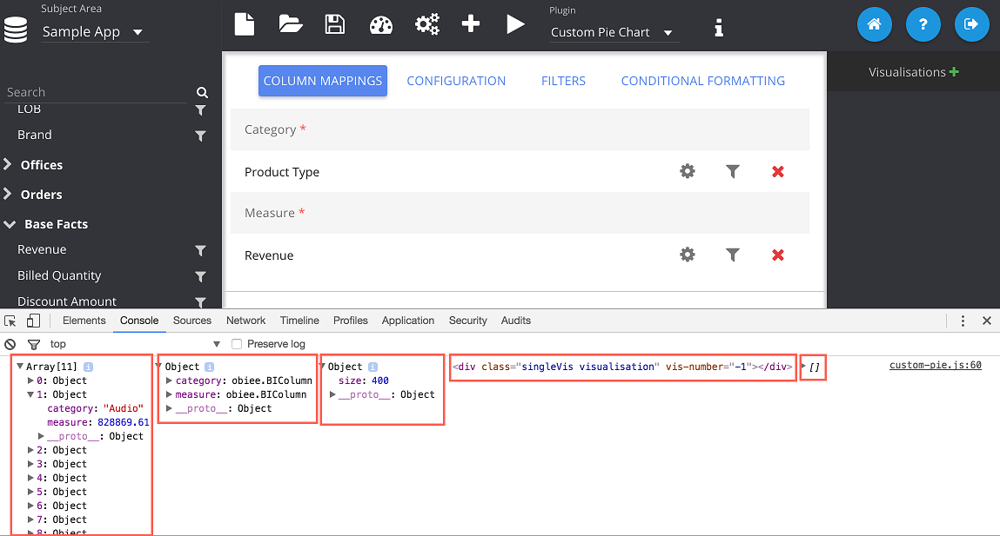

In the console we can see the first argument is the data array where each element is an object with property names equal to the column mapping IDs we gave earlier. The next argument is an object with properties the same as the column mapping IDs, this time they are [BIColumn objects](api/module-obiee.BIColumn.html) that contain information about the columns the user has selected:

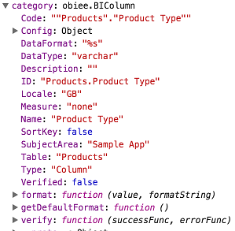

The third argument is an object with the configuration properties and values in it. This will be updated if the user changes anything in the configuration tab (test this yourself!). The fourth parameter is the DOM element, you don't need to glean much from looking at it in the console, this is just a reference point on the page at which to perform our rendering. The fifth object is for conditional formatting but since we haven't defined any yet, it's an empty array.

Save your visualisation to the catalogue in `/shared/Test` and then prompt the UI with that path. Now whenever you refresh that page it will open your saved report.

## Making a Basic Pie Chart

Most of the plugins have been reworked from the [D3 gallery](https://d3js.org/) and this one is [no different](https://bl.ocks.org/mbostock/3887235). In this section we'll add code to our render function and see how it builds up the plugin. As soon as you save a change in the plugin file, you should be able to refresh your browser and see the result.

Put this code in the `render` function (line 60) to draw a basic pie chart. You can delete the console logging line.

```javascript
// Set width, height, radii based on configuration parameters
var width = +config.size, height = +config.size;
var radius = +config.size / 2;

// D3 arc function which will be referred to later
var arc = d3.svg.arc()
    .outerRadius(radius - 10)
    .innerRadius(0);

// Tie D3 pie layout to the measure attribute
var pie = d3.layout.pie()
    .sort(null)
    .value(function(d) { return +d.measure; }); // measure is the column map property name

// Create a div to put our pie chart in our parent container
var chartContainer = d3.select(container)
    .append('div')
    .classed('pie-chart', true);

// Create SVG for our D3 chart
var chart = chartContainer.append("svg")
    .attr("width", width)
    .attr("height", height)
    .append("g")
        .attr("transform", "translate(" + width / 2 + "," + height / 2 + ")");

// Creates pie slices for our data set
var g = chart.selectAll(".arc")
    .data(pie(data)) // Passing in data here
    .enter().append("g")
        .attr("class", "arc");

// Draw the arcs and colour them all red.
g.append("path")
      .attr("d", arc)
      .style("stroke", "white") // Outline white
      .style("fill", 'red');
```

 Execute the test report and you should see something similar to below:

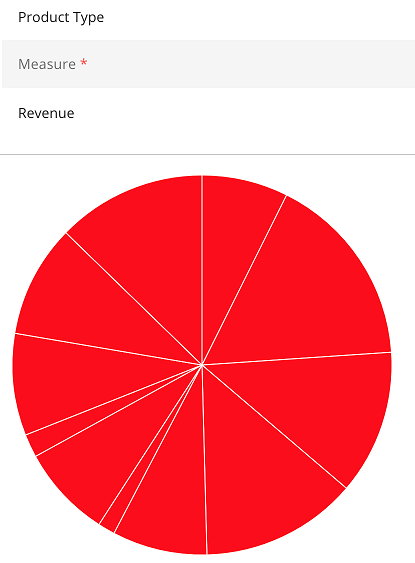

Now try testing with different attributes and measures. You should see the visualisation updating accordingly. You now have a working visualisation, although I will concede it's not too fancy (or even usable) yet.

## Adding Colours

RM Insights features a colour palette system as well as single colour pickers. Palettes are useful when you want to pick a series of colours with a dynamic number of elements. In the `configurationParameters` object (line 39) add another parameter for the colour palette.

```javascript
{
    targetProperty:"colours",
    label: "Colours",
    inputType: "palette",
    inputOptions: {
        "defaultValue": "Flat-UI"
    },
    desc: 'Colour palette to use for discrete series colours.'
}
```

Run your test again and visit the configuration tab and you should see a palette picker.

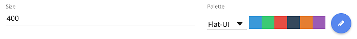

Now back in the `render` function (line 69) add the following lines to the beginning:

```javascript
// Set colour scale
var colourNames = data.map(function(d) { return d.category; }); // Gives a list of the attributes in our chart
var colour = rmvpp.colourScale(colourNames, config.colours); // RM function to create a colour scale
```

This snippet calls a packaged [`rmvpp`](api/module-rmvpp.html#.colourScale) function to return a [D3 colour scale](https://github.com/d3/d3-3.x-api-reference/blob/master/Ordinal-Scales.md). Now the `colour` variable is a function that takes a `category` value as a single argument and returns a colour from the palette.

E.g. if your categories are 'Audio', 'Camera' and 'Fixed', they might be assigned '#5da5da', '#2fcc71' and '#e84c3d' respectively. So executing `colour('Fixed')` will return `'#e84c3d'`.

Now on line 109 where we set the colour (previously red), change it to:

```javascript
.style("fill", function(d) { return colour(d.data.category); }); // Uses the value of the colour for the given point
```

This is a common syntax with D3 where this function executes for each datum in the assigned data series. So `d.data` in this context is a single datum with properties `measure` and `category`. We use this to give a custom colour for each attribute:

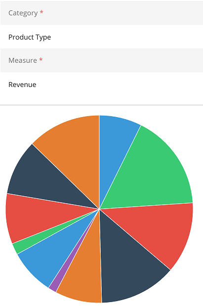

You can also play around with changing the colour scheme and adding custom colours in the configuration pane, the chart should update accordingly.

# Enhancing the Visualisation

## Adding a Legend

There's an `rmvpp` class for adding a [legend](api/module-rmvpp.Legend.html) to charts. After we declare our `chart` object (lines 93-97) add the following lines to automatically put a colour key legend on the chart.

```javascript
// Args: chart object, key names, title, width of the chart
var legend = new rmvpp.Legend(chart, colourNames, columnMap.category.Name, radius); // Uses the category names from before
legend.addColourKey(colourNames, colour); // Requires the colour scale we defined earlier
legend.repositionCircular(); // Resizes and positions for a circular layout
```

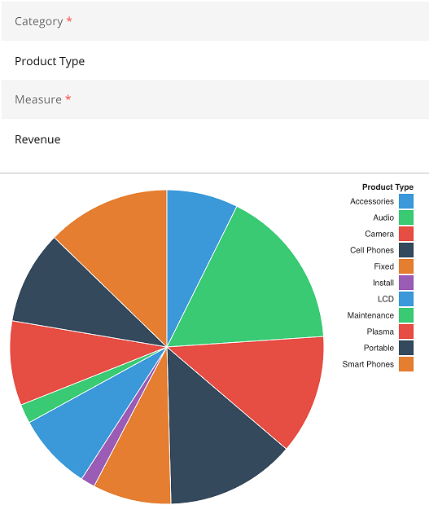

## Adding a Tooltip

Similarly to the legend, there's a class for adding [tooltips](api/module-rmvpp.Tooltip.html) to visualisations. Declare the tooltip after the `chartContainer` declaration (lines 88-90):

```javascript
// Create tooltip
var selector = $(chartContainer[0]).toArray();
var tooltip = new rmvpp.Tooltip(chartContainer[0][0]);
```

This creates an HTML object for our tooltip that is tied to our visualisation, but does not handle the display of it. We will implement a mouse-over tooltip here using a [D3 mouse event](https://github.com/d3/d3-3.x-api-reference/blob/master/Selections.md#on). Find where the sections are drawn (line 115-118) and replace the block with:

```javascript
g.append("path")
      .attr("d", arc)
      .style("stroke", "white")
      .style("fill", function(d) { return colour(d.data.category); })
      .on('mouseover', function(d, i) {
          // Args:
          // Column values we want to display in the tooltip
          // Column mapping with column information
          // Datum for this section
          // D3 mouse event object (used for positioning)
          tooltip.displayFull(['category', 'measure'], columnMap, d.data, d3.event);
      })
      .on('mouseout', function(d, i) {
         tooltip.hide(); // Hides the tooltip when the mouse leaves the section
      });
```

This should now produce a tooltip when you hover over the chart that will move, fade in and out as the mouse moves over the pie chart.


## Conditional Formatting

Insights has an interface for communicating conditional format rules from the user to the plugin. If you select the **Conditional Formatting** tab you should see a message saying that formatting is not possible for this plugin. If you switch to a different plugin, like Table, then you should see a plus icon. This is because the plugin has definitions in it which tell the UI that conditional formatting is allowed. We'll configure that here.

In the `columnMappingParameters` definitions (lines 12-19), add the `conditionalFormat` property, set to `true`, to the `category` column definition.

```javascript
{
    targetProperty:"category",
    formLabel:"Category",
    type: 'dim',
    required: true,
    conditionalFormat: true,
    desc: 'Attribute for each section in the pie.'
}
```

Now if you use the conditional format tab you can add a conditional format definition.

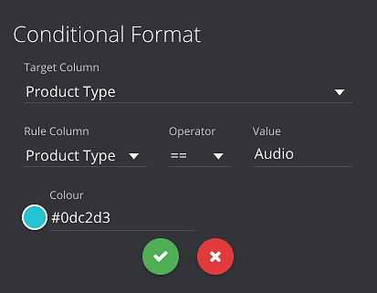

However running the report won't change anything in the pie chart. This is because we haven't done anything in the `render` function which references the conditional formatting. The `render` function passes `condFormats`, and array of [format definitions](api/module-obiee.BIConditionalFormat.html) that the user has specified. The console output for the rule I defined above is show below.

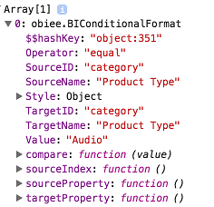

Find the part of the code where we set the `fill` colour of the sections (line 119). We can update this function to check if a conditional format rule is true, and then override the colour if so. The `compare` method of the formatting object will evaluate this for you if you pass data to it.

Replace the fill function with the code below.

```javascrtipt
.style("fill", function(d) {
    var bg = colour(d.data.category); // Default to the colour palette
    condFormats.forEach(function(cf) { // Loop through defined format rules
        if (cf.compare(d.data)) // If a rule is true
            bg = cf.Style.colour; // Override the colour
    });
    return bg;
})
```

Now when we re-run the visualisation we can see the format rule applied. You can change the format rule and see the chart update as well.

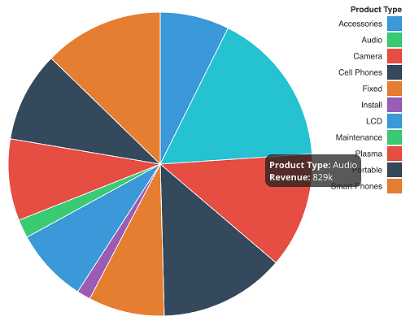

## Adding interactivity

Here will we show how to make the pie chart able to send information to other visualisations on the page using the interactivity framework. First we need to update our test report to include another visualisation that can be updated by our pie chart interactions.

Add a table plugin with the same columns as you chose for the pie chart and save it. Switch to dashboard mode and define an [interaction](tutorials/10---adding-chart-interactions.html) from the table to the pie chart. You should be able to click on the table view and the pie chart should filter. This is because of the default filter object in the `reactions` property (line 57).

However if you try it the other way around, you'll see *No interactions available* for the pie chart.

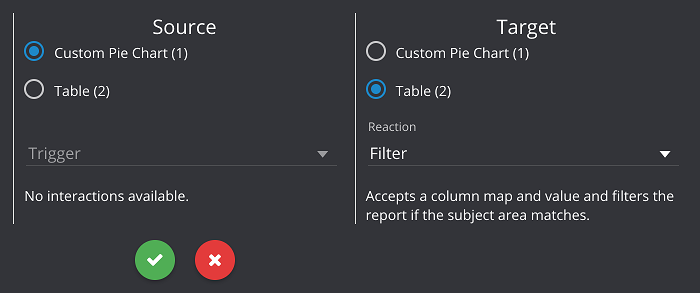

Replace the `actions` property (line 53) with the following snippet:

```javascript
rmvpp.Plugins[pluginName].actions = [
    {
        'trigger' : 'clickSlice', // ID for the trigger
        'type' : 'click', // Type of interaction
        'name' : 'Click Slice', // Name shown to the user
        'output' : ['category'], // Column property to pass data on
        'description' : 'Click a slice to pass the data.' // Description for the user
    },
    {
        'trigger' : 'hoverSlice',
        'type' : 'hover',
        'name' : 'Hover Slice',
        'output' : ['category'],
        'description' : 'Hover over a slice to pass the data.'
    }
];
```

This defines two interactions so the UI will now allow the user to define them in the Interactivity dialogue. However we still need to actually implement the interaction in the `render` function. Currently if you try to define an interaction nothing will happen.

Go to the `mouseover` event (line 146) and add the following after the line that shows the tooltip.

```javascript
// Args: Plugin ID, column map, HTML container, Trigger ID, datum object
rmvpp.createTrigger(pluginName, columnMap, container, 'hoverSlice', d.data); // Trigger event
```

This [`rmvpp` function](api/module-rmvpp.html#.createTrigger) will take the data passed to it and trigger an interaction with another visualisation if it has been defined. This particular one will enable the mouse-over interactions, and we can add a similar call in a click callback (line 150):

```javascript
.on('click', function(d, i) {
    rmvpp.createTrigger(pluginName, columnMap, container, 'clickSlice', d.data); // Trigger event
})
```

# Appendix

## Code for Pie Chart

This is the complete code for the pie chart made in this tutorial.

```javascript
rmvpp = (function(rmvpp){ // Extends the rmvpp object

    var pluginName = "custom-pie"
    rmvpp.Plugins[pluginName] = {};
    rmvpp.Plugins[pluginName].id = pluginName;
    rmvpp.Plugins[pluginName].displayName = "Custom Pie Chart";
    rmvpp.Plugins[pluginName].description = 'Pie chart visualisation used to display discrete information. Can hover over slices for tooltip information.';
    rmvpp.Plugins[pluginName].icon = "pie-chart";

   // Mapping between RPD columns and the visualisation
   rmvpp.Plugins[pluginName].columnMappingParameters = [
       {
           targetProperty:"category",
           formLabel:"Category",
           type: 'dim',
           required: true,
           conditionalFormat: true,
           desc: 'Attribute for each section in the pie.'
       },
       {
           targetProperty:"measure",
           formLabel:"Measure",
           type: 'fact',
           required: true,
           desc: 'Measure influencing the size of each slice.'
       }
   ];

   // Global configuration for the plugin - must have width and height or size at minimum.
   rmvpp.Plugins[pluginName].configurationParameters = [
        {
           targetProperty:"size",
           label: "Size",
           inputType: "textbox",
           inputOptions: {
               "subType" : "number",
               "defaultValue": 400
           },
           desc: 'Size of the pie chart in pixels.'
        },
        {
           targetProperty:"colours",
           label: "Colours",
           inputType: "palette",
           inputOptions: {
               "defaultValue": "Flat-UI"
           },
           desc: 'Colour palette to use for discrete series colours.'
        }
   ];

   // Interactions the user can make on this visualisation (e.g. click, highlight)
   rmvpp.Plugins[pluginName].actions = [
       {
           'trigger' : 'clickSlice', // ID for the trigger
           'type' : 'click', // Type of interaction
           'name' : 'Click Slice', // Name shown to the user
           'output' : ['category'], // Column property to pass data on
           'description' : 'Click a slice to pass the data.' // Description for the user
       },
       {
           'trigger' : 'hoverSlice',
           'type' : 'hover',
           'name' : 'Hover Slice',
           'output' : ['category'],
           'description' : 'Hover over a slice to pass the data.'
       }
   ];

   // Reactions this visualisation can have to other interactions. Everything can use filters
   rmvpp.Plugins[pluginName].reactions = [
       {
           id : 'filter',
           name : 'Filter',
           description : 'Accepts a column map and value and filters the report if the subject area matches.',
           type : 'general'
       }
   ];

   // This is provided all of the information required to make the visualisation at run-time.
   // Your code to make the visualisation in the container DOM element should go here.
   rmvpp.Plugins[pluginName].render = function(data, columnMap, config, container, condFormats)   {
        // Set colour scale
        var colourNames = data.map(function(d) { return d.category; }); // Gives a list of the attributes in our chart
        var colour = rmvpp.colourScale(colourNames, config.colours); // RM function to create a colour scale

        // Set width, height, radii based on configuration parameters
        var width = +config.size, height = +config.size;
        var radius = +config.size / 2;

        // D3 arc function which will be referred to later
        var arc = d3.svg.arc()
           .outerRadius(radius - 10)
           .innerRadius(0);

        // Tie D3 pie layout to the measure attribute
        var pie = d3.layout.pie()
           .sort(null)
           .value(function(d) { return +d.measure; }); // measure is the column map property name

        // Create a div to put our pie chart in our parent container
        var chartContainer = d3.select(container)
           .append('div')
           .classed('pie-chart', true);

        // Create tooltip
        var selector = $(chartContainer[0]).toArray();
        var tooltip = new rmvpp.Tooltip(chartContainer[0][0]);

        // Create SVG for our D3 chart
        var chart = chartContainer.append("svg")
           .attr("width", width)
           .attr("height", height)
           .append("g")
               .attr("transform", "translate(" + width / 2 + "," + height / 2 + ")");

        // Args: chart object, key names, title, width of the chart
        var legend = new rmvpp.Legend(chart, colourNames, columnMap.category.Name, radius); // Uses the category names from before
        legend.addColourKey(colourNames, colour); // Requires the colour scale we defined earlier
        legend.repositionCircular(); // Resizes and positions for a circular layout

        // Creates pie slices for our data set
        var g = chart.selectAll(".arc")
           .data(pie(data)) // Passing in data here
           .enter().append("g")
               .attr("class", "arc");

        // Draw the arcs and colour them all red.
        g.append("path")
             .attr("d", arc)
             .style("stroke", "white") // Outline white
             .style("fill", function(d) {
                 var bg = colour(d.data.category); // Default to the colour palette
                 condFormats.forEach(function(cf) { // Loop through defined format rules
                     if (cf.compare(d.data)) // If a rule is true
                         bg = cf.Style.colour; // Override the colour
                 });
                 return bg;
             })
             .on('mouseover', function(d, i) {
                 // Args:
                 // Column values we want to display in the tooltip
                 // Column mapping with column information
                 // Datum for this section
                 // D3 mouse event object (used for positioning)
                 tooltip.displayFull(['category', 'measure'], columnMap, d.data, d3.event);
                 // Args: Plugin ID, column map, HTML container, Trigger ID, datum object
                 rmvpp.createTrigger(pluginName, columnMap, container, 'hoverSlice', d.data); // Trigger event
             })
             .on('click', function(d, i) {
                 rmvpp.createTrigger(pluginName, columnMap, container, 'clickSlice', d.data); // Trigger event
             })
             .on('mouseout', function(d, i) {
                tooltip.hide(); // Hides the tooltip when the mouse leaves the section
             });
   }

   return rmvpp; // Required to extend rmvpp correctly

}(rmvpp || {})) // Closes the extension
```
