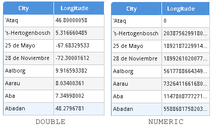

% Numeric Data Type

# Problem

The OBIEE web service has a very serious bug which prevents columns with the `NUMERIC` data type from being reported correctly. This manifests as numbers coming back totally incorrectly (much larger or smaller with no commonality) or simply as 0. It happens consistently whenever querying for a `NUMERIC` column, including if that data type has been dynamically assigned using `CAST`. Note that this problem does **not** occur in vanilla OBIEE.

The screenshot above shows two instances of a similar query, with the first casting the longitude as `DOUBLE` and the second as `NUMERIC`. The first results are correct and match the database whilst the second are nonsense. It can be verified that the physical SQL is **identical** for the two queries.

Numeric columns are typically used preferentially over double columns in order to circumvent the [floating point limitation](https://docs.oracle.com/cd/E28280_01/bi.1111/e10540/data_types.htm#BIEMG4605).

As of 8 Jun 2016, there is no record of this bug on [Oracle Support](https://support.oracle.com), and the problem can be reproduced on the following OBIEE versions:

* **11.1.1.7150120**
* **11.1.1.9.160149**
* **12.2.1.0.160149**

# Solution

An imperfect workaround has been implemented which automatically casts any `NUMERIC` columns to `DOUBLE`. This will leave the system susceptible to rounding errors due to the  [floating point limitation](https://docs.oracle.com/cd/E28280_01/bi.1111/e10540/data_types.htm#BIEMG4605) but will at least report the numbers broadly correctly.

This logic has been tied to a configuration variable `InsightsConfig.NumericToDouble`. As such, the behaviour can be removed at such time as Oracle repair the web service, without having to alter any of the application code.

# Other Possible Workarounds

## Execute as XML

This problem only occurs when using the `executeSQLQuery` web service method, **not** when using `executeXMLQuery`. However, the `executeXMLQuery` method has limitations of its own, mainly that it cannot retrieve more than 2500 records at a time. Additionally, the level of complexity in creating valid XML to send to the server is far greater than in generating logical SQL. This increases. the likelihood of errors occurring in the code.

## Alter the RPD

Physical columns in the RPD can be changed to `FLOAT`, `INTEGER` or `DOUBLE` but this requires manual work and is susceptible to rounding errors due to the  [floating point limitation](https://docs.oracle.com/cd/E28280_01/bi.1111/e10540/data_types.htm#BIEMG4605).
