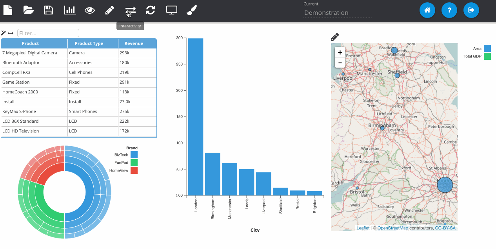

% Adding Chart Interactions

Insights supports a framework whereby you can specify interactivity between objects on the dashboard. For example when you hover over an element it highlights and element on another visualisation on the page. Or perhaps when you click on an object it filters a different one.

Whilst in *Dashboard Mode*, click on the *Interactivity* button to open the options in the main panel and select the **Interactions** tab. Click the plus icon to add a new interaction.

Some interactions are specific to a visualisation type (like the one above). Every type of visualisation can receive a filter interaction. This will apply the filter to the query and execute it against the BI server and fetch the data. Below is an example of such an interaction and also shows how you can edit interactions once they've been applied.

