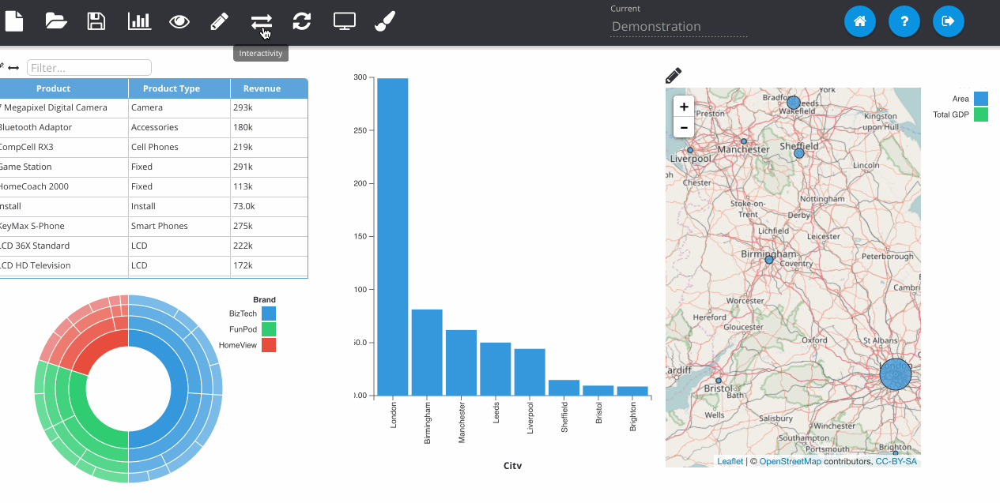
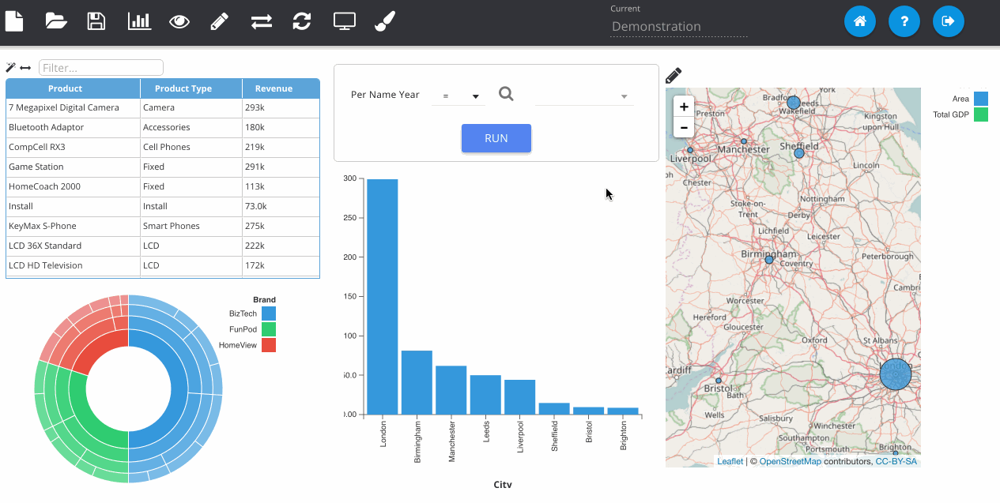

% Adding Drill-downs

If we have more than one dashboard page saved to the catalogue, we can set up a drill-down between them, so that when we click on an element on one dashboard, it takes us to the next dashboard, filtering it for any information.

Click the *Interactivity* button to open the interactions panel and select the **Drilldowns** tab. Click on the plus icon to add a new drilldown. Select the visualisation you wish to use as the source in the middle pane as well as the interaction type (click, hover etc.).

Then in the left-most panel choose the columns that you want to pass through in filters. For visualisations whereby a click could pass through multiple values, the user is able to choose specifically which columns they want to filter the next dashboard on.

Finally, use the web catalogue explorer in the right-most panel (folder icon) to choose the target dashboard page. Double click in the explorer to select a dashboard.

Make sure you **Save** the dashboard before testing the drill-down.

There will be a breadcrumb at the top of the dashboard you've drilled to that allows the user to navigate back. This is appended if multiple drill downs have been defined. Additionally, dashboard prompts are filtered and their values are retained when using drill functionality. The example below has dashboard prompts on each page which show the filters that have been passed through to each stage.

