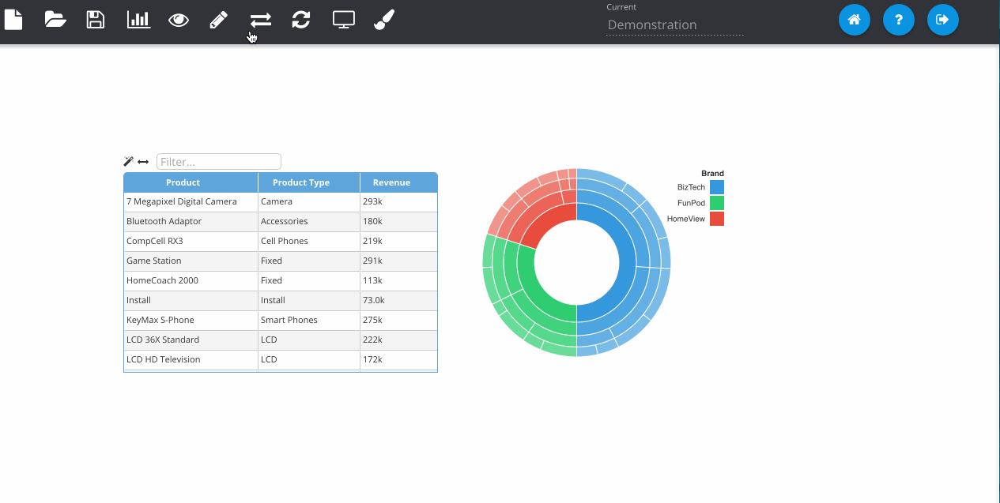
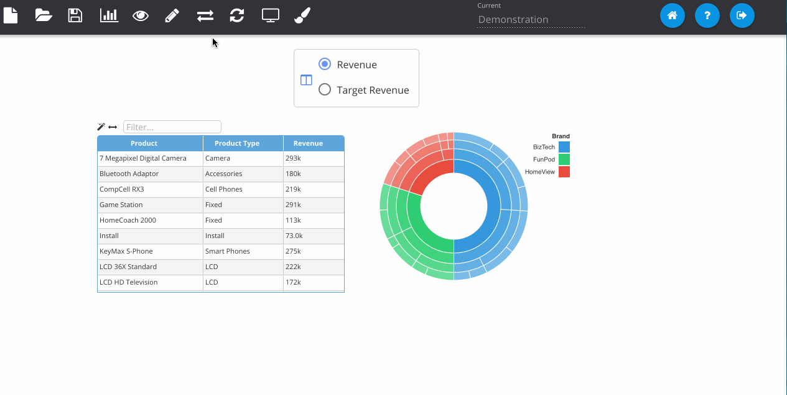

% Adding Column Selectors

*Column Selectors* can be used to automatically exchange RPD columns and update visualisations. Insights allows you to do this and define which columns should be swapped in which visualisations.

First click on the *Interactivity* button and choose the **Column Selectors** tab. Then click the plus icon to open the column selector dialogue. Here you can select columns from the RPD that you want to dynamically exchange. Then you choose the display type (drop-down or radio buttons) as well as which visualisations are affected.

Insights will find any instances of that column in the visualisations on the page, and swap them with the one that you choose in the widget. The example below updates both visualisations to swap between Revenue and Target Revenue.

The next example shows the column selector being changed to a dropdown and configured to only update the Table visualisation.

