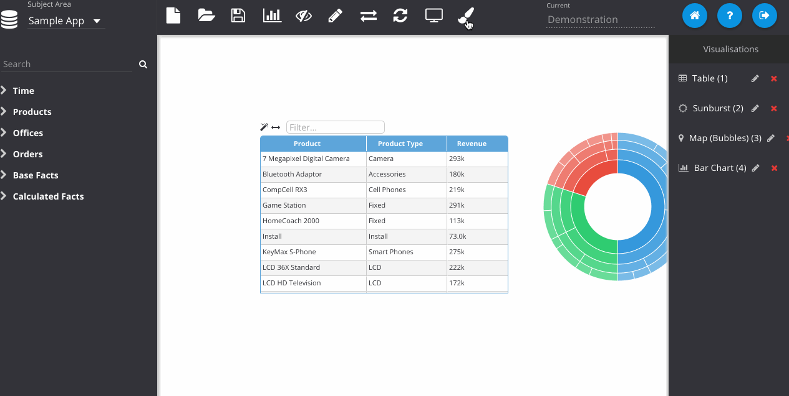

% Annotating Dashboards

Insights features a primitive dashboard annotation system whereby you can add text, images and draw shapes on a dashboard page. Click the paintbrush icon to switch to *Design Mode*. In this mode you can use the panel on the left to add text or shapes to the canvas and add simple styles.

In design mode you can drag and scale any of the objects on the canvas and their positions and sizes will be retained when you're finished editing.

You can reference images in this mode as well, but they need to be hosted online somewhere that is accessible to the application, Insights itself cannot upload your own files. However, you can upload custom images to a location in the `insights` deployment and they will be accessible.