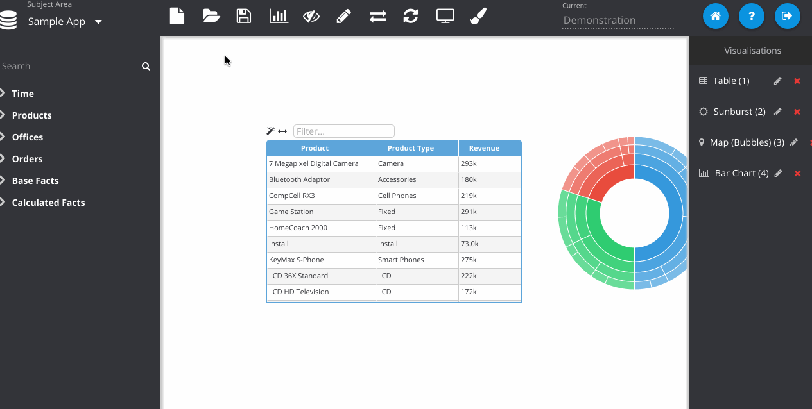

% Publishing Dashboards

Once multiple dashboard pages have been saved, they can be published as a single package that will appear on the home page portal. This works by exposing a folder in the web catalogue as a dashboard and will display all of the reports in that directory as separate pages.

To publish a dashboard, open the web catalogue explorer (click the folder icon) and navigate to a folder that you wish to publish. Click the publish sub-icon next to that folder and it will open the publishing dialogue. Here you can set a description for the dashboard and also choose an icon that the dashboard will use in the portal screen. Additionally you can tag dashboards to make them searchable on information that is not part of the title.

The dashboard can be unpublished from this screen by opening the catalogue explorer and clicking the un-publish icon next to the folder.
