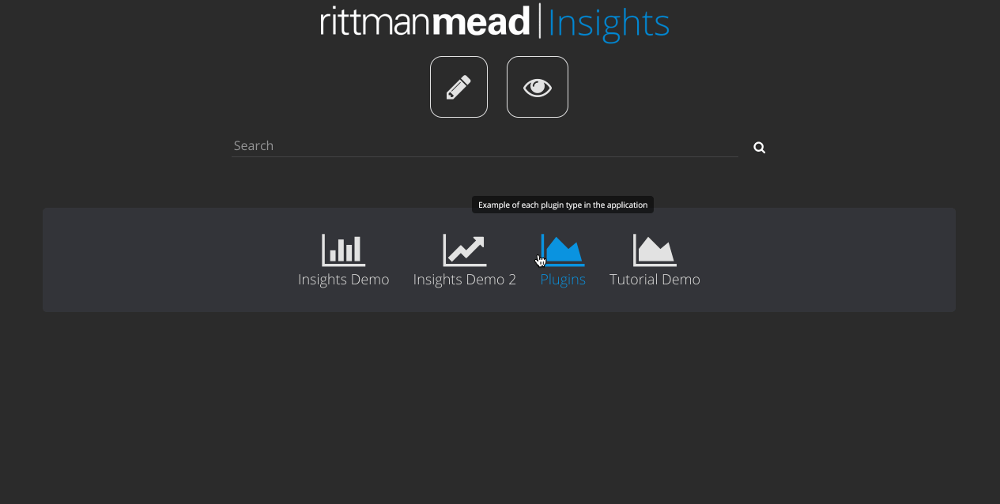
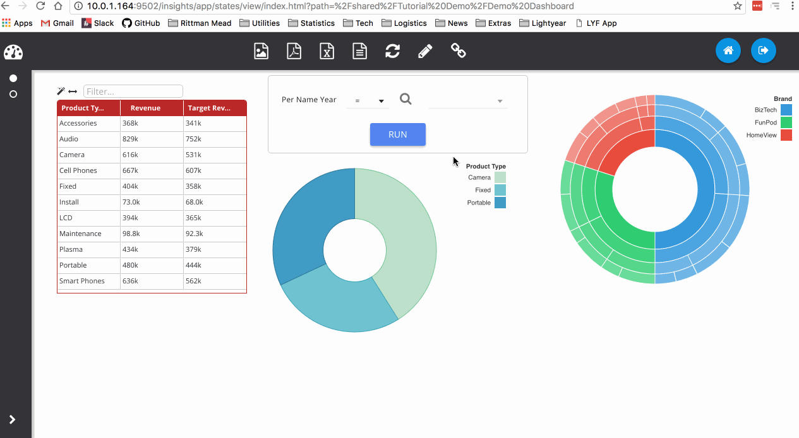

% Viewing Dashboards

Once dashboards have been made and published, you can see them in the portal screen on the Insights homepage. Clicking on one of these will take you to the *Dashboard Viewer* and open the first page of that folder. You can select other pages from the left panel (expandable with the button at the bottom) and use the icons on the toolbar to export the dashboard to various formats. Note that the CSV and Excel exports will only export the **data**, not the visualisations.

The refresh button will reload the page from the catalogue, thus resetting any prompts or interactions you may have set. The edit button (pencil) will take you to the dashboard editor and open this page for editing. Lastly, the link button will copy a link to the dashboard page to the clipboard. This is a special link that will also contain any dashboard prompts that you may have selected.

The example below demonstrates use of the refresh button and an example of getting a link with dashboard prompt values.

