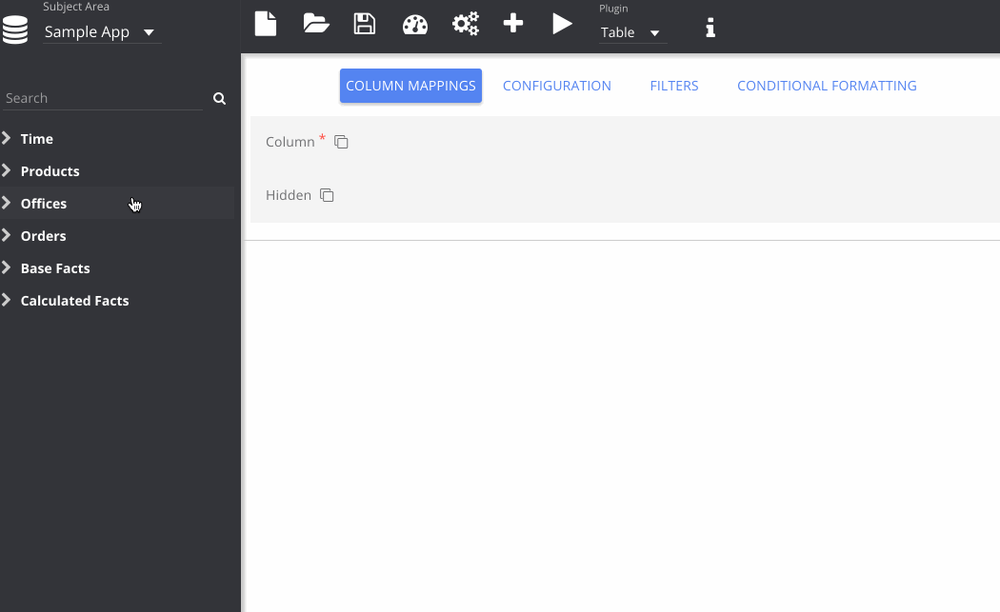

% Mapping Columns to a Plugin

You can double-click or drag-select columns into the mapping panel, viewed by selecting **Column Mapping** from the options panel. Different plugins have different mapping options, so depending on which plugin you are using, you will need to choose fields appropriately.

Different *Subject Areas* can be chosen from the drop-down in the top left. Some mapping fields accept multiple columns, and these are indicated by an icon next to the label, as for *Column* on the Table plugin. Similarly, required fields are indicated by an asterisk.

Some plugins, like *Table*, have a two-way binding between the plugin and the column mapping panel. This means that modifying the columns in the plugin automatically updates the configuration panel.

