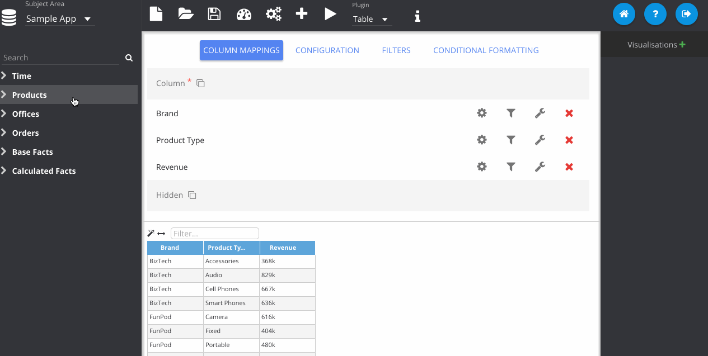
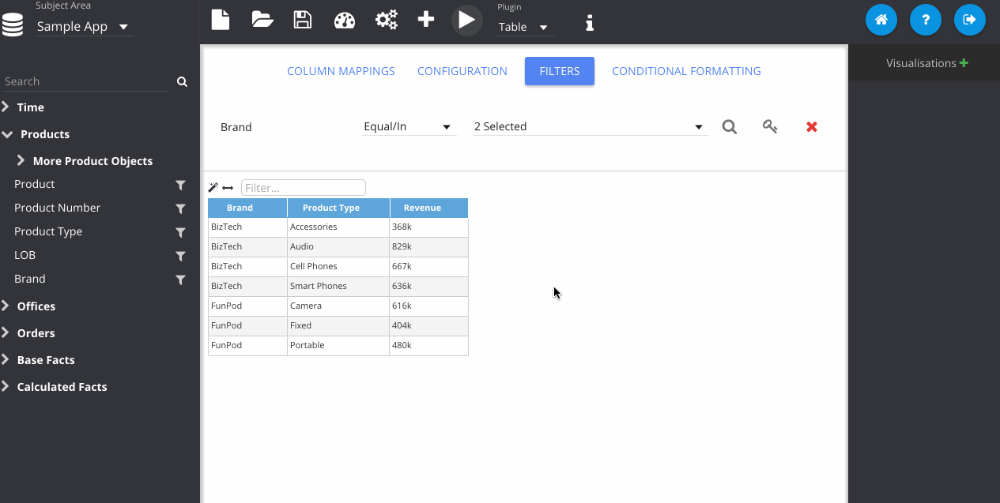

% Filtering Data

Filtering queries can be done by clicking the filter icon next to the RPD column on the left pane. This will open the *Filters* panel in the main panel section. This will allow you to choose different values which will constrain the query.

This list will contain 100 values of the selected column, but no more. If you require to filter on a value outside of this list, you will need to use the *Advanced Search*. The search facility here will look for any values in the list with the search terms.

