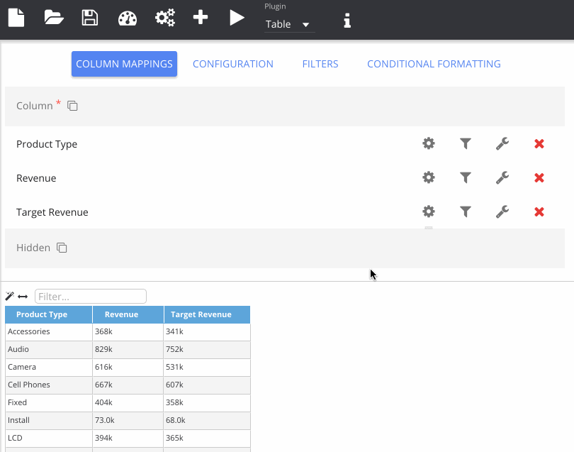

% Editing Columns

You can edit column formulae and change the formatting style using Insights. The example below shows renaming and changing the calculation for a measure. The data format is also changed, using the [D3 format](/insights/docs/data-formats.html) specification for numbers. Repository and session variables are available in this screen and the picker will also show a preview of the value. You can also use OBIEE functions here and there is a port of the function library to help with this.

