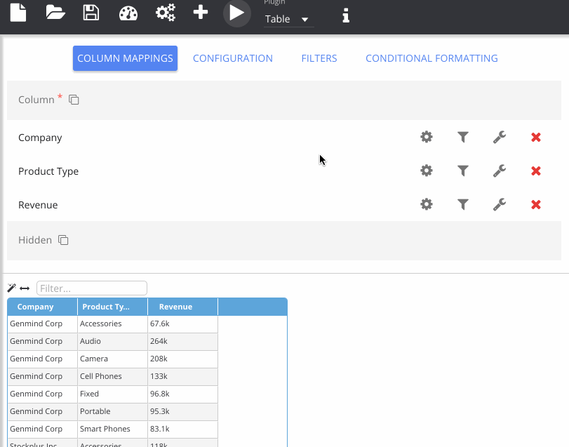
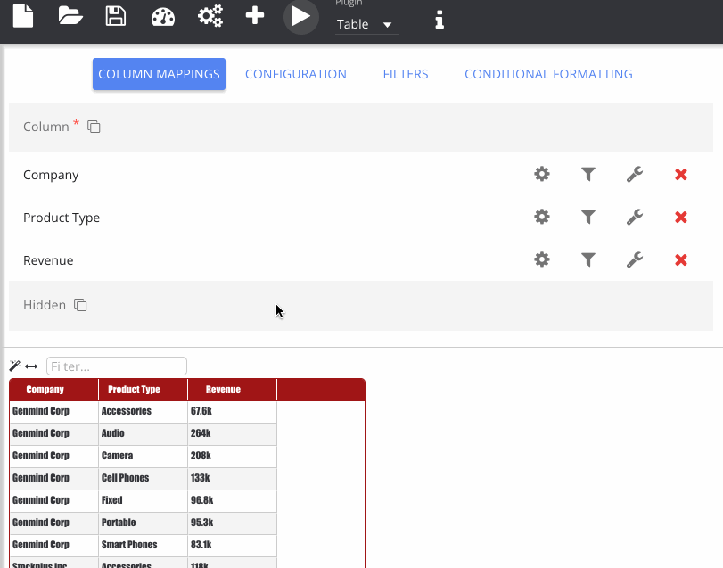

% Changing Plugin Options

Select **Configuration** from the options panel to see the configurable parameters for the currently selected plugin. These values will be passed to the visualisation at run-time, allowing a level of customisation to the user.

Some plugins have column level options as well as the plugin level options which is indicated by a spanner icon next to columns in the *Column Map*. These options will be tied specifically to the column, rather than the whole plugin. The *Table* example has some of the options, like for the column width. Two-way binding between the plugin and the configuration panel are also possible: so when a user changes a column width in the table, the configuration values will also change.

