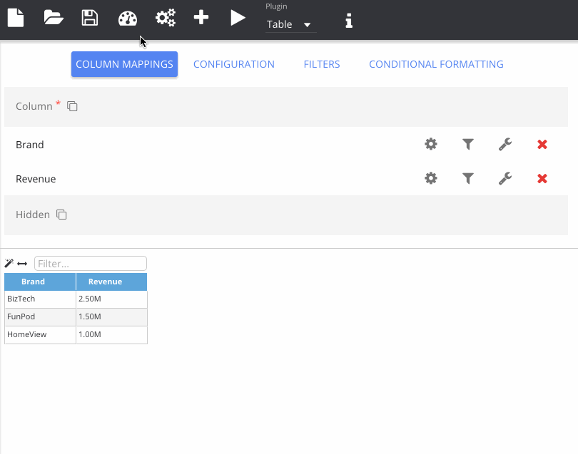

% Saving Your Work

Insights uses the OBIEE web catalogue to store reports and manage security. As with any tool, it is vitally important that you save your work regularly. Saved objects can also be opened from this catalogue and permissions managed from within the app.

Click the floppy disk icon to open the catalogue explorer and navigate through to the location you wish to save. Give your report a name and click the save icon. Now when re-visiting the application you can click the folder icon to go open your saved work. In the catalogue explorer there is a little key icon which opens the permissions dialogue. That lets you modify the security permissions for an object, e.g. restricting access to only administrators like the example below.

