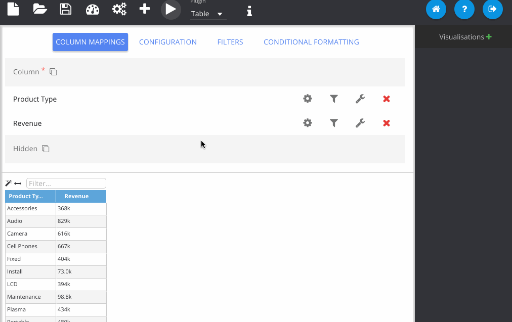
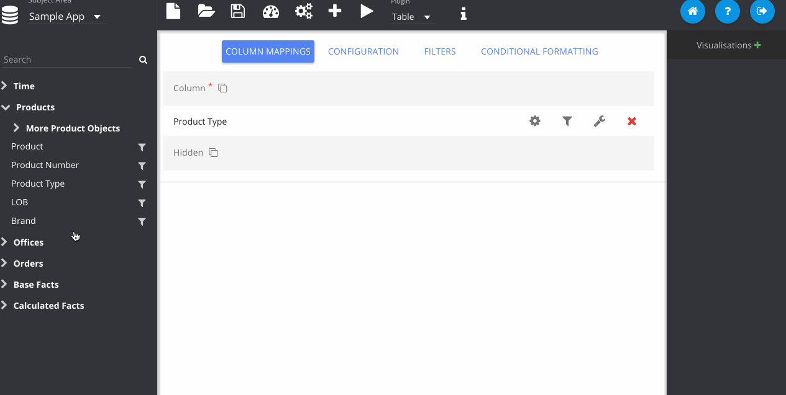

% Working With Multiple Visualisations

Once you have made a visualisation it will be stored when you attempt to switch to another plugin type. Stored visuals can be seen on the right panel. Above this list there is a button (plus sign) that you can use to manually store the visual. Clicking on a name in the list will switch back and forth between your stored visuals. They can be removed using the delete button next to the name.

Note that this method is a bit clunky if you want to create two visualisations of the *same* plugin type consecutively. In that case, you should use the **New** button and select *Visualisation*. This  will store your existing visual and reset the column map.

