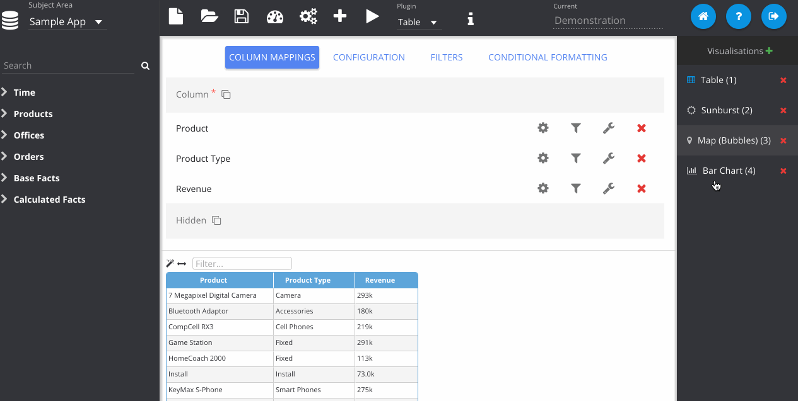

% Laying Out A Dashboard

Once you have made some visualisations you can begin placing them on the canvas using the Dashboard editor. You should have a list of your visualisations on the right hand side. Now click the *Dashboard Mode* button and the app will flick to the dashboard canvas. Drag in your visualisations from the right onto the canvas and they should appear. Next click the pencil icon to activate *Edit Mode*. Now you can freely position and size your visualisations on the page.

Additionally in this mode you can use the *Delete* cross in the top left of the visualisations to remove them from the canvas. Your work is still stored, and you can fetch them back from the right panel if you need them.
