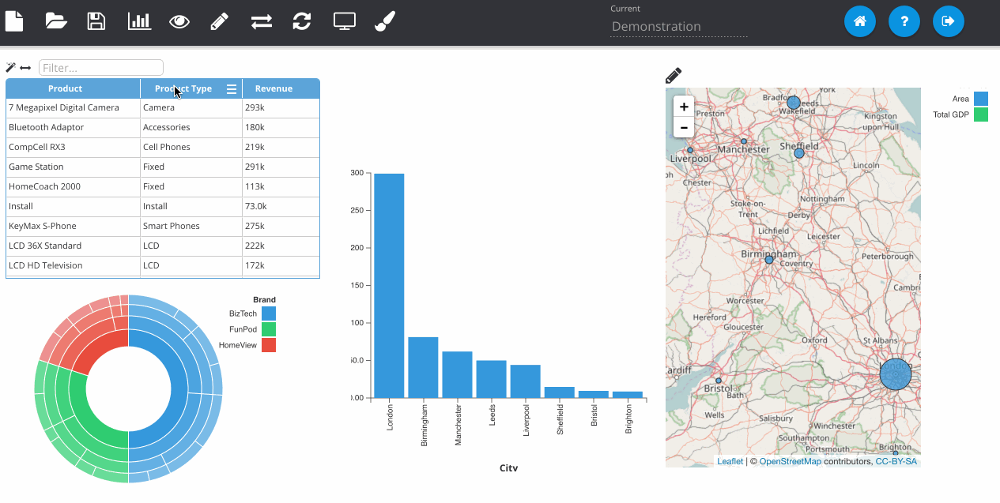
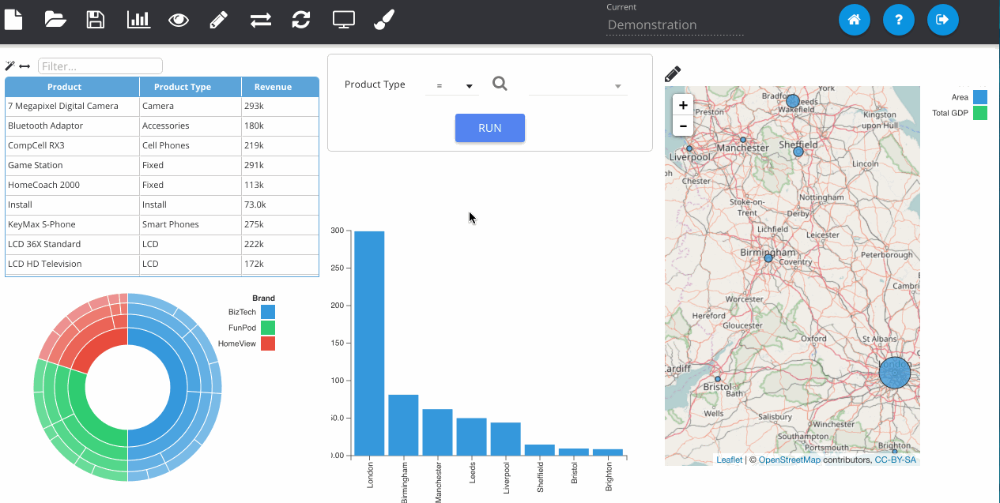

% Using Dashboard Prompts

*Dashboard Prompts* are filters which sit on the dashboard and can be used to update all of the visualisations on the page. To add one, go to *Dashboard Mode* and click on the filter icon next to a column from the RPD on the left-most panel. Each visualisation on the page that is from the same subject area as the column will be automatically updated when the dashboard prompt is ran. Dashboard prompts also have the advanced search facility from regular filters.

There are a lot of options when using a dashboard prompt. The example below shows how to set a default value and change the input type to a radio button.

Additionally you can set default values from variables or logical SQL. You can also derive the available drop-down choices from logical SQL. Note that you should always **save** your work before hitting the refresh/reload button as it loads the report from the catalogue and you may lose your changes.

