% Dashboard Editor

The dashboard editor is a separate mode of the [visualisation editor](creating-visualisations.html) but both are fundamentally the same application. Once one or more visualisations have been created and stored in the visualisation editor, they can be placed on the screen to build a dashboard page. This mode also allows dashboard prompts to be added as well as interactivity. This allows a user to save an entire page with multiple visualisations and queries as a single object in the web catalogue. This differs from OBIEE, where each visualisation (analysis) is its own object. The layout of the editor is shown below.

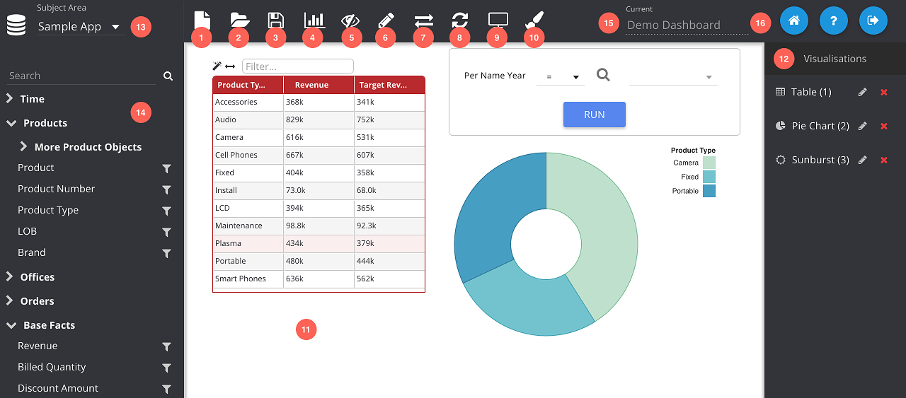

1. **New:** Clears the dashboard page and *all* of the associated artefacts.
2. **Open:** Opens the web catalogue explorer, allowing a full dashboard page and all of the associated visualisations to be loaded.
3. **Save:** Saves the dashboard to the catalogue. If it is a new dashboard the catalogue explorer will be opened, otherwise it will just overwrite the file.
4. **Show/Hide Panes:** Hides (and shows) the left and right panels.
5. **Visualisation Builder:** Switches to the visualisation builder.
6. **Edit Mode:** Enables edit mode which allows the user to move visualisations around the screen as well as resize them. Visualisations will have a dashed blue border when edit mode is active.
7. **Interactivity:** Shows/hides the interactivity option pane with the following tabs:
	* Interactions
	* Drill-downs
	* Column Selectors
	* Visual Selectors
8. **Refresh:** Reloads the dashboard from the catalogue.
9. **Run Dashboard:** Navigates to the dashboard viewer, opening the current dashboard page. Will prompt you to save before leaving.
10. **Design Mode:** Enables the designer mode, allowing annotations and custom drawing on the page.
11. **Dashboard:** Layout of the dashboard page. Visualisations can be dragged into this area from the right pane (12). Artefacts can be moved around this area when edit mode (6) is active.
12. **Visualisations:** Available visualisations which can be dragged onto the dashboard area.
13. **Subject Area:** Choose the OBIEE subject area to query.
14. **Columns:** Shows the hierarchy of columns in the chosen subject area. The search box can be used to filter this list. Clicking the filter button will add a dashboard prompt to the page for that column.
15. **Dashboard Name:** Displays the name of the currently opened dashboard. Only appears once the dashboard has been saved.
16. **Links:** Home will take you to the portal page, Help will take you to this documentation page, and the Logout button will end your session and take you to the login screen.

The dashboard mode can be opened automatically when the app loads by specifying the query parameter: `mode=db`, e.g. `/insights/app/states/dbBuilder/index.html?mode=db`.

# Dashboard Prompts

Dashboard prompts are dynamic filters that are visibly present on the dashboard page and provide an interface for viewers of the dashboard to modify the values. Dashboard prompts can be added by clicking the filter button of a subject area column when in *Dashboard Mode*. A prompt object will automatically be added to the screen as can be seen below.

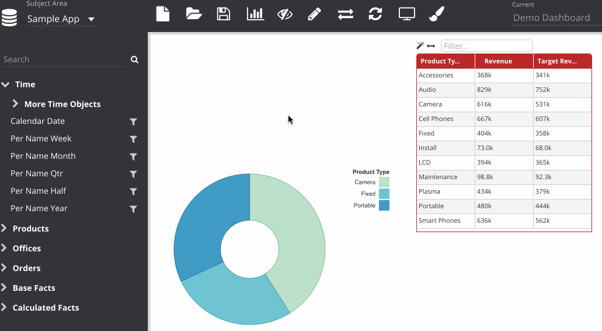

Any visualisations from the same subject area as the prompt column will be refreshed with the filter applied. There are three types of prompt, automatically created depending on the data type, indicated by the icon to the right of the prompt:

* **Picklist:** for attributes/dimensions.
* **Date:** for date columns.
* **Number:** for measures.

The pick list is similar to regular filters and contains 100 values queried from OBIEE. [As before](#advanced-filter-options), a user can click on the search icon to open a dialogue for searching for specific values not in the default list. Users can also change the operator of a prompt by choosing a value from the drop-down to the left of the prompt.

## Editing Prompts

In *Edit Mode*, there are some further options that can be altered for prompts.

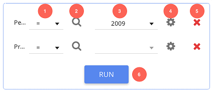

1. **Operator:** Change the operator for the filter:
	* Equal/In
	* Not Equal/In
	* > (Greater than)
	* >= (Greater than or equal to)
	* < (Less than)
	* <= (Less than or equal to)
	* Is Null
	* Is Not Null
	* Top (Ranking)
	* Bottom (Ranking)
	* Like (Accepts `%` as a wildcard character)
2. **Advanced:** Opens a dialogue allowing the user to search for specific values, or change the filter to use an OBIEE variable or logical SQL.
3. **Select Values:** Multi-select drop-down of available values for the given column. Shows 100 items only, so you need to use the advanced search if you require something outside of that list. Also features a search facility, but this too is only scanning the 100 available items.
4. **Options:** Opens the prompt options window with advanced options for modifying the prompt.
5. **Remove:** Removes the filter from the prompt. When all filters are removed, the whole prompt is removed from the page.
6. **Run:** Click this to execute the filters, updating any eligible visualisations. By default, prompts are set to be 'go-less' so do not require this button to be clicked to refresh the dashboard and instead will update as soon as the value is changed. Hovering over a prompt will also show some descriptive text in this box.

The options button allows for the greatest modification of the filter object.

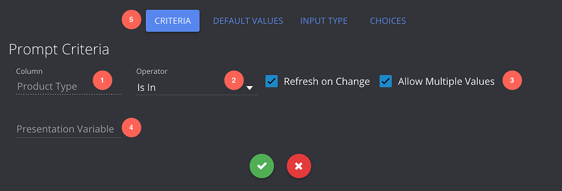

1. **Column Name**
2. **Operator:** Logic for the filter.
3. **Runtime Options:**
	* **Go-less:** When checked, the dashboard will automatically update when the filter value is changed.
	* **Multiple Values:** When checked, the user can select multiple values from a picklist filter. Only applies to pick lists, not date or number filters.
4. **Presentation Variable:** Sets a [presentation variable](advanced-report-building.html#presentation-variables) when the filter is fired.
5. **Tabs**

In addition to global options, default values can be added by switching to the other tab. This screen shows a list of values that will populate the filter automatically when the dashboard loads. Multiple values can be added here and can be specific values or derived from variables or LSQL as per [filters](#advanced-filter-options).

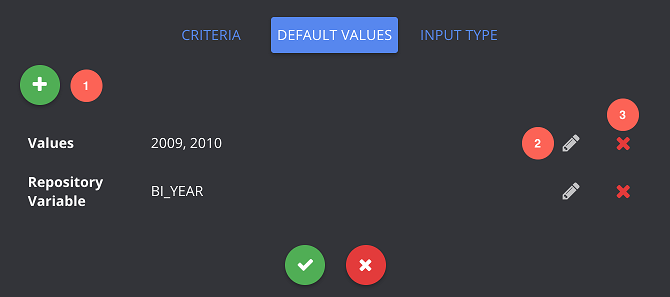

1. **Add Default Value**
2. **Edit Value**
3. **Remove**

Finally, you can change the UI type of a dashboard prompt to checkboxes or to a radio button. Given the display nature of this, you have to manually select the choices you want to make available.

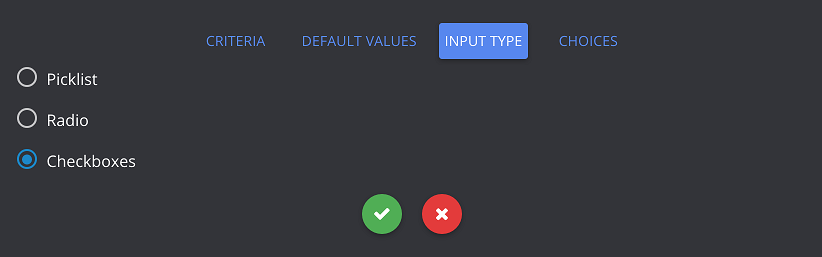

Simple radio pick list with the display types of a dashboard prompt. Some display types will have additional options, like the slider, which will have Min/Max settings available.

The radio setting produces the following prompt:

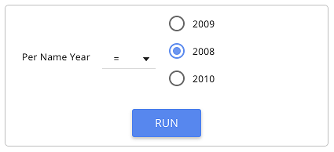

The choices tab allows the report developer to restrict the possible options available to users. 

1. **Choice Type:** Either *LSQL* or *Values*, which means the choices are either dynamically fetched from a logical SQL statement (top 100 rows) or are specifically defined.
2. **LSQL:** Logical SQL statement to fetch prompt choices.
3. **Wizard:** Will automatically reset the logical SQL to the default for that column.

# Interactivity

Insights supports a range of dashboard interactivity which are all accessed using the panel enabled through the interactivity button. The following interactivity types are available:

* **Interactions:** Actions made on one visualisation on a page which should update another visualisation using the data. E.g. clicking on a bar to automatically filter a table.
* **Drill-downs:** Actions made on a visualisation will navigate to another dashboard page applying prompts and filters.
* **Column Selectors:** drop-down or radio buttons allowing different columns to be swapped in  visualisations on the page.
* **Visual Selectors:** Drop-downs or radio buttons allowing different visualisations entirely to be swapped between.

The following sections explain how to configure and edit these and all have a similar interface.

Each of the interactivity tabs will show a list of currently defined dashboard features. For example, a configured interaction is shown below:

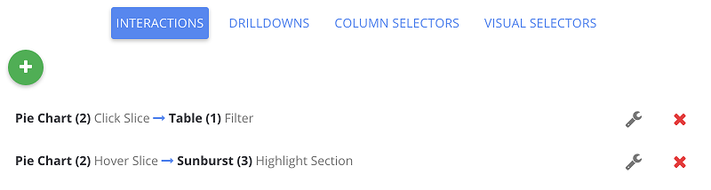

1. **New:** Creates a new interaction and opens the edit screen.
2. **Remove:** Removes the interaction from the dashboard.
3. **Edit:** Opens the edit screen with the context of the chosen interaction.

## Interactions

Interactions between visualisations require an *action* on the source visualisation which invoke a *reaction* on the target visualisation. This reaction can be based on the data passed into it from the action. The example below shows a chart and table, both with product type. When hovering over the rows in the table, the bars in the chart are highlighted. Similarly, when clicking a bar, the table is filtered.

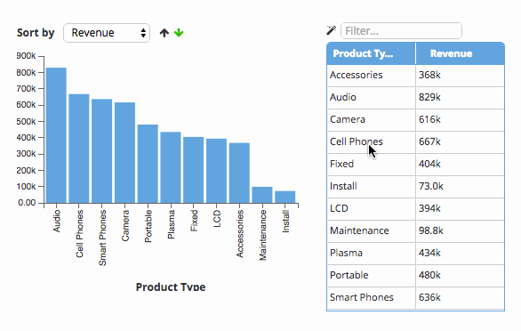

The edit screen for configuring an interaction is shown below.

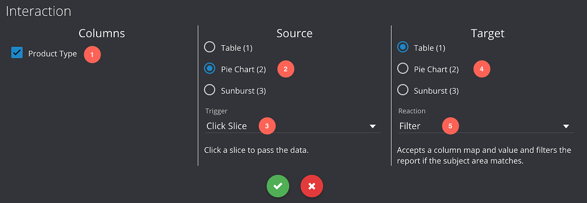

1. **Data Columns:** The filter action will pass data from the columns selected from this list.
2. **Source Visualisation:** Drop-down from available visualisations on the page.
3. **Source Action:** List of available actions for that visualisation. These are defined by the plugin developer.
4. **Target Visualisation**
5. **Target Action:** List of available reactions for the target. Every visualisation will have *Filter* as a type which filters the OBIEE query and reloads the visualisation. Some other plugin types might have special reactions like *Highlight Bars* on bar charts. These custom actions can be developed by a plugin developer.

## Drill-downs

Drill-downs go between dashboard pages and pass across filters and prompts from the previous pages. A breadcrumb trail will appear in the top left of the page, allowing users to navigate back through the path they have chosen, preserving any modified dashboard prompt values. An example is shown below.

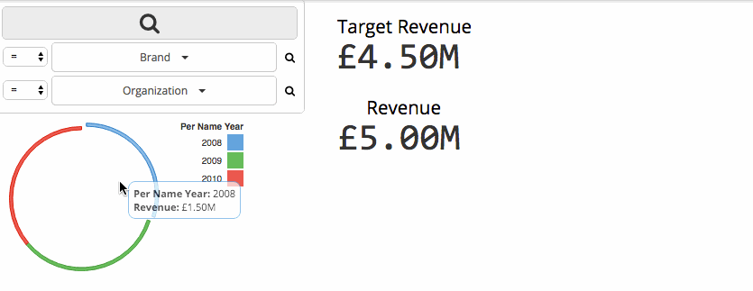

Like interactions, an action should be chosen for the source visualisation, e.g. *Click - Row*. The actions available for drill-downs for a given plugin are identical to those for regular dashboard interactions. The configuration screen is shown below.

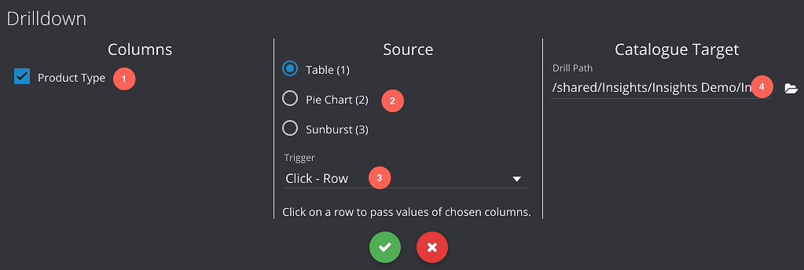

1. **Data Columns:** The filter action will pass data from the columns selected from this list.
2. **Source Visualisation:** Drop-down from available visualisations on the page.
3. **Source Action:** List of available actions for that visualisation. These are defined by the plugin developer.
4. **Target:** Web catalogue path to the target dashboard page. Clicking the folder icon will open the catalogue explorer.

## Column Selectors

Column selectors allow a user to switch between a defined list of columns, updating one or more visualisations on the page.

They are configured by selecting a list of columns and choosing a UI type. A list of target visualisations is also chosen, so that the column selector can only affect certain graphics. A target visualisation **must** contain at least one of the columns in the selector list to be affected.

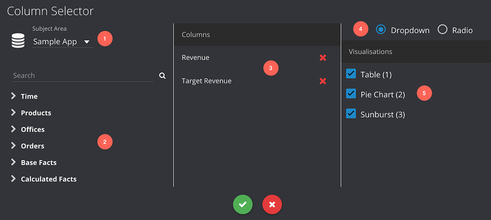

1. **Subject Area:** Subject area for the column selector, will automatically affect *all* visualisations of the same subject area.
2. **RPD Columns:** Columns for the subject area, these can be dragged to the columns list or double clicked to add.
3. **Columns:** Drag (or double click) columns from the subject area on the left pane into this list.
4. **Style:** UI style for the picker, choose between *Drop-down* and *Radio* buttons.
5. **Visualisations:** Choose the visualisations that should be affected by this selector.

## Visual Selectors

These allow the user to select between different visualisations on the page. This is similar to view selectors in OBIEE, but there is no restriction on the views having the same query or data behind them.

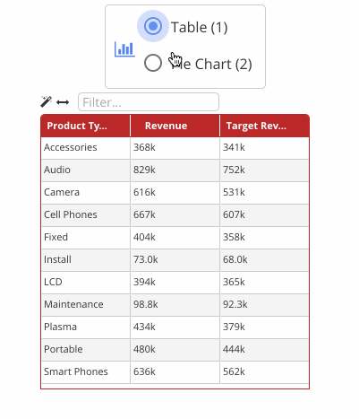

These are configured by selecting a UI type as well as a selection of visualisations on the page to choose between. Only one of the visualisations in the list will be visible at any given time. The visualisations can be positioned by dragging them around in edit mode, just as before.

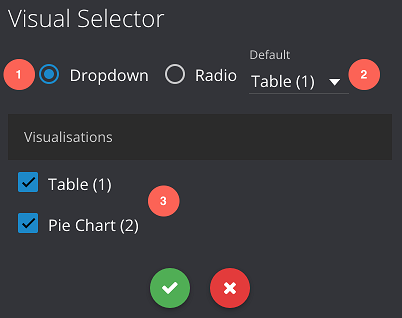

1. **Style:** UI style for the picker, choose between *Drop-down* and *Radio* buttons.
2. **Default Visualisation:** Selects the default that will be chosen upon dashboard load.
3. **Visualisations:** List of visualisations to choose between.

# Designer

The application as a minor graphical designer feature that allows you to make annotations and use uploaded images. These definitions of these images are saved with the rest of the dashboard page and are re-rendered upon loading. Enable *Design Mode* by clicking the paintbrush icon on the toolbar. In this mode you can add and draw objects on the canvas and move them about freely. You can drag-select and CTRL-click in this mode to select multiple objects on the canvas. You will not be able to interact with any visualisations in this mode.

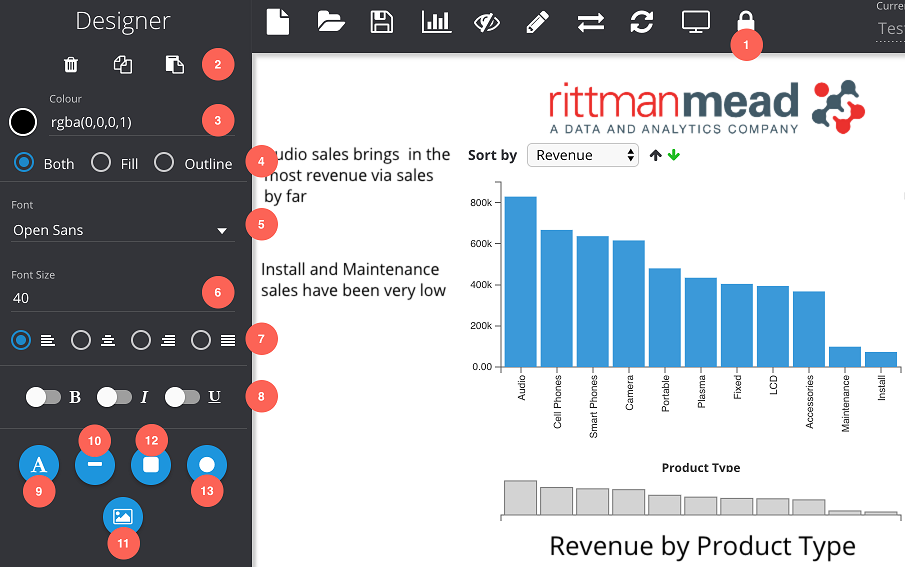

1. **Lock Changes:** Locks design mode, keeping the changes made.
2. **Controls:** Operations work on the currently selected objects.
	* Delete
	* Copy
	* Paste
3. **Colour:** Colour of the selected objects or for a new object..
4. **Style:** Switches between filled or outline for selected objects.
5. **Font:** Font for new or selected text.
6. **Font Size**
7. **Text Alignment:** Left, centered, right and justified.
8. **Font Style:** Bold, italics and underlined.
9. **Add Text:** Adds some text to the canvas that can then be edited.
10. **Draw Line:** Whilst selected, the user can draw a straight line on the Canvas.
11. **Draw Rectangle:** Whilst selected, the user can draw a rectangle or hold Shift to draw a square.
12. **Draw Ellipsis:** Whilst selected, the user can draw an ellipsis or hold Shift to draw a circle.
13. **Add Image:** Opens a popup to add an image. A URL must be provided, so only images that are hosted and accessible from the application can be used.

# Publishing Dashboards

In Insights, a dashboard is simply a web catalogue folder containing one or more Insights pages. The default page in Insights is the [portal](/insights/app/states/portal) which has links to the [visualisation editor](visualisation-editor.html) as well as the [dashboard viewer](dashboard-viewer.html). In addition, the portal contains a search-able list of published dashboards available to the user. If the user does not have read access to a published dashboard folder, it will not appear in this list.

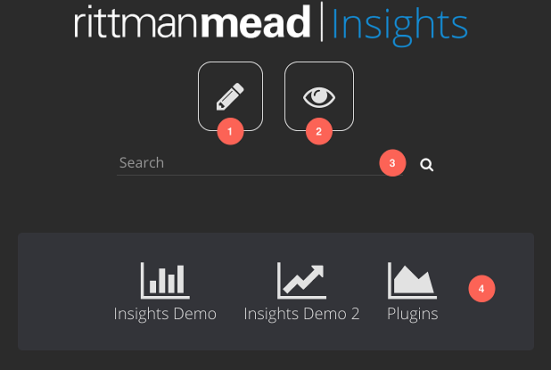

1. **Create Dashboard:** Link to the [dashboard builder](/insights/app/states/visBuilder)
2. **Explore Catalogue:** Links to the [dashboard viewer](/insights/app/states/view), opening the catalogue explorer.
3. **Search:** Instant search feature for the published dashboards. Can search on the dashboard name as well as tags that can be attributed to the dashboard when publishing them.
4. **Dashboards:** List of published dashboards indicated by their icons. Hovering over them will display the description for the dashboard.

In order to get dashboards to appear in this list they need to be published. This can be done using the catalogue explorer to select a folder and then clicking the 'Publish As Dashboard' button.

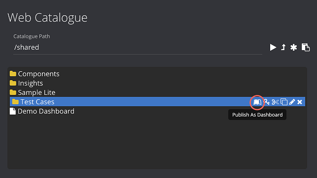

A menu window will open with inputs that allow you to define various properties about the dashboard for use with the portal.

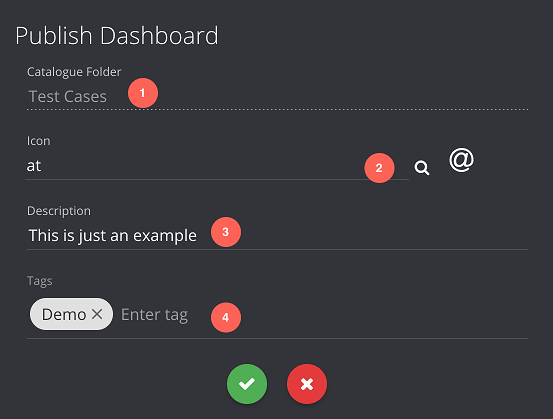

1. **Folder/Dashboard Name:** Name of the web catalogue folder will be used as the name of the dashboard.
2. **Icon:** Icon to be displayed in the dashboard portal.
3. **Description**
4. **Tags:** Assign tags to the dashboard which are also searched for when using the dashboard portal.

On accepting, the dashboard will be published and accessible from the portal if the user has permissions to read that folder. Properties can then be edited and the *Un-publish* button can be used to remove the dashboard from the published list at any time.

