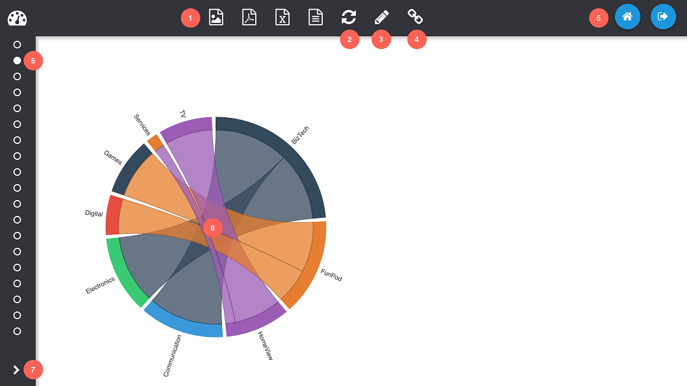

% Viewing Dashboards

Dashboards are viewed from the [dashboard view](/insights/app/states/view) which allows full screen viewing of the dashboard without any of the configuration controls.



1. **Exports:**
	* Export to PNG
	* Export to PDF
	* Export to Excel
	* Export to CSV
2. **Refresh:** Reloads the dashboard from the catalogue, refreshing the state.
3. **Get Link:** Copies a [link](advanced-report-building.html#presentation-variables) to the dashboard page to the clipboard. Additionally this will pass through any filter values that have been set.
4. **Pages:** Indicates the other dashboard pages in the folder. Clicking on the icons will load the respective dashboard page.
5. **Expand Sidebar**
6. **Home, Logout**

The dashboard viewer URL accepts [query string](https://en.wikipedia.org/wiki/Query_string) parameters which tell the viewer which dashboard or page to load. If no parameters are provided, the catalogue explorer is opened and the user can choose a dashboard page manually.

* `db` : Expects a catalogue path to folder containing Insights pages.
* `path` : Expects a catalogue path to a single Insights page.
* `hidePanes=true`: When specified explicitly as `true`, will hide the top and left panels and reposition the main content accordingly.

E.g.

```
/insights/app/view/states/index.html?db=/shared/Insights/Dashboard
/insights/app/view/states/index.html?path=/shared/Insights/Dashboard/Page 1
/insights/app/view/states/index.html?path=/shared/Insights/Dashboard/Page 1&hidePanes=true
```
