% Visualisation Editor

This section serves as a guide to using the Insights [visualisation builder](/insights/app/states/visBuilder) to create and store visualisations. You can also access this page from the pencil icon at the top of the page on the portal.

Building visualisations with Insights differs from OBIEE in that there is no separation between dashboard pages and analyses. Instead, a single object in Insights defines a whole dashboard page, with one or more **Visualisations** defined. A Visualisation object is akin to an analysis in that it specifies the RPD columns and filters to use in the query but differs in that it also specifies the **Plugin** (chart renderer) and any configuration options. Visualisations are defined in the *Visualisation Mode* of the editor. Using the *Dashboard Mode* of the editor will allow you to lay out one or more visualisations, define interactivity and prompts if required. All of this information is stored as a single object in the web catalogue when saved.

# Visualisation Builder

The default view of the page is the visualisation builder. This part of the application allows the user to create analyses using data OBIEE and visualised through the Insights plugins. The layout of this screen is shown below.

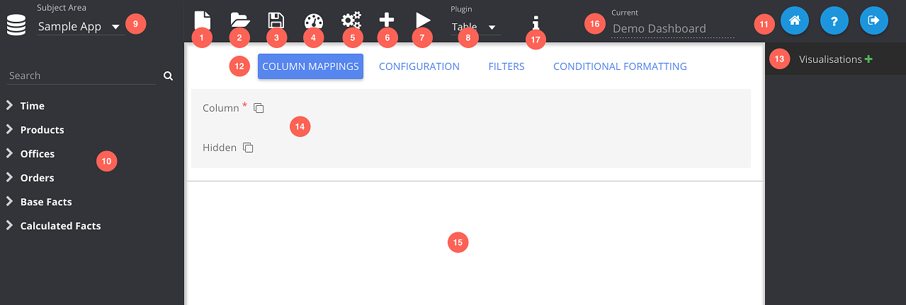

1. **New:** clears all columns, filters and configuration as well as any dashboard artefacts defined. It does *not* remove any stored visualisations however.
2. **Open:** Opens the web catalogue explorer and allows the user to load saved visualisations.
3. **Save:** Saves the *active* visualisation to the web catalogue. Will open the web catalogue explorer if the visualisation has not been saved, otherwise will simply overwrite the file.
4. **Dashboard Mode:** Switches to the dashboard editor.
5. **Show/Hide Options:** Hides (and shows) the option panel (13).
6. **Add Column:** Creates a new column definition and opens the edit column panel.
7. **Run:** Executes the query and renders the visualisation.
8. **Plugin:** Chooses the type of visualisation from a list of available plugins.
9. **Subject Area:** Choose the OBIEE subject area to query.
10. **Columns:** Shows the hierarchy of columns in the chosen subject area. The search box can be used to filter this list. Columns can be double clicked to be added to the visualisation or dragged in manually. Clicking the filter button by a column will create a filter for that column and switch the option context.
11. **Links:** Home will take you to the portal page, Help will take you to this documentation page, and the Logout button will end your session and take you to the login screen.
12. **Options Panel:** The main configuration panel where the user can configure options for all features pertaining to the visualisation. The buttons at the top will switch the configuration context:
	* Column Mappings
	* Configuration
	* Filters
	* Conditional Formatting
13. **Current Visualisations:** Shows a list of defined visualisations. The plus icon can be clicked to store the current query and configuration. Then the user can switch between visualisations and make modifications as required. Visualisations will be automatically stored when changing the plugin type.
14. **Configuration Panel:** This panel changes depending on which options setting is selected. Displayed in the screenshot is the column mapping panel.
15. **Plot Area:** The area where the visualisation is plotted after clicking the run button (8).
16. **Visualisation Name:** Displays the name of the currently opened visualisation. Only appears once the visualisation has been saved.
17. **Plugin Help:** Will take you to the documentation page for the currently selected plugin.

Basic visualisation creation and selection is shown below.

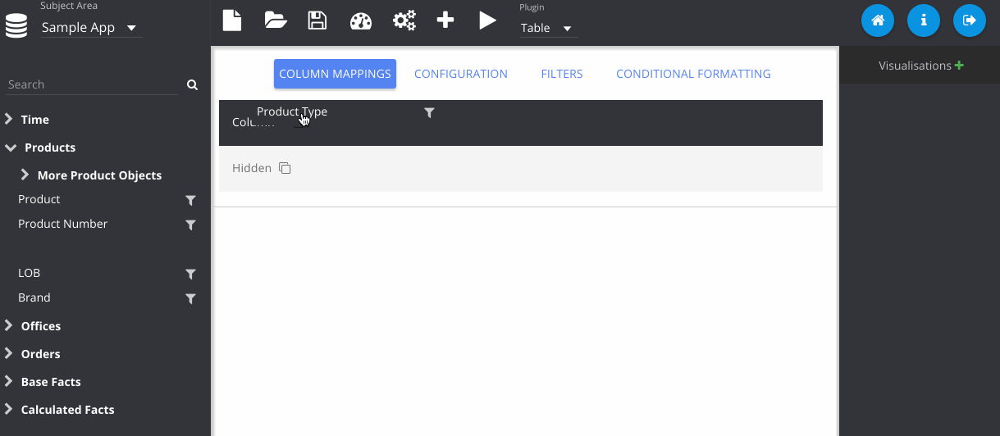

## Column Map

Each plugin type has a set of column mapping properties defined which dictate how the visualisation will use the data provided. The example shows the table plugin which has two *properties* defined, each accepting multiple columns. The asterisks indicate that only the Column property is required for the visualisation to execute. Some plugins will allow multiple columns for a definition, others will only allow single column for that option. When running the visualisation, the app will query OBIEE for the columns chosen, applying any filters that have been configured.

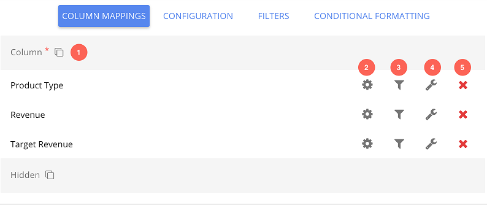

1. **Mapping Name:** This indicates to the user what feature in the plugin the column will be mapped to. For the table plugin they are *Column* and *Hidden*, where the latter is optional. Adding columns to the *Column* mapping will display them in the table, whereas in the *Hidden* section the data will be fetched but not displayed. Each plugin will have different mappings and they are customisable by the plugin developers.
2. **Column Properties:** Opens the [column editing](#edit-column) panel where the name, data format and formula can be modified.
3. **Filter:** Adds a filter for this column and switches to the filter screen.
4. **Column Configuration:** Some plugins have column configuration for certain properties as well as global configuration. This is configuration that may differ for each column. E.g. for the table plugin, column widths can be defined here.

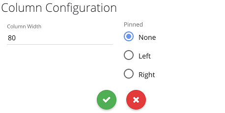

5. **Remove:** Removes the column from the mapping.

### Edit Column

The edit column screen allows the modification of column properties like the name, formula and data types. This interface is the same for editing columns as well as adding new ones. When new columns are created they are automatically put into a group called *Custom* in the subject area.

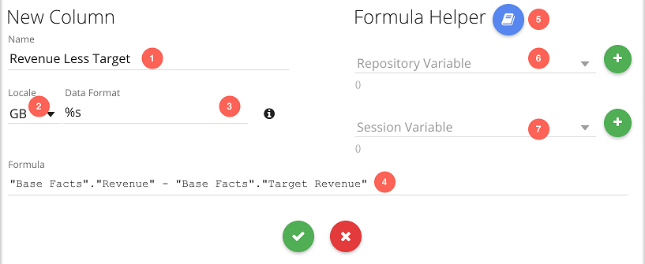

1. **Column Name**
2. **Locale:** Locality of the column, chosen from a list of configured localities. Allows the correct formatting of different currencies.
3. **Data Format:** [Formatting string](/insights/docs/data-formats.html) for data value display.
4. **Formula:** OBIEE column formula. On confirming changes a validation check will be executed to see if the formula is valid. Other column definitions can be dragged into the text area from the subject area panel.
5. **Formula Helper:** Opens a popup with skeleton examples for available formulae in the OBIEE expression grammar.


## Configuration

The configuration screen shows all of the options for the currently selected plugin. This configuration differs with each plugin type. Upon first opening the configuration screen, the preset defaults are displayed for each option, along with input elements for modifying the parameters.

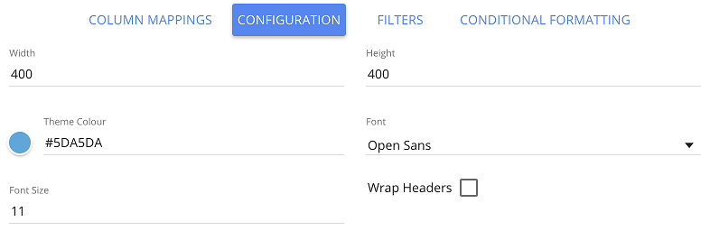

The screenshot above shows the options for the table plugin. They include a colour picker, font picker and some options for adjusting the sizes of the font and table.

The [plugin developer](developing-plugins.html#configuration) is able to specify these options when they define a plugin and the values chosen by the user will be passed to the visualisation upon rendering.

## Filters

Shows all of the filters and values that have been applied to the query. The filters will be applied using `AND` logic. Currently there is **no** way to use `OR` logic or grouped filter logic.

By default attribute columns have a picklist to choose one or more values from a list of up to 100 possible values for the column. Date columns will have a date picker. Measure columns require you to type a number.

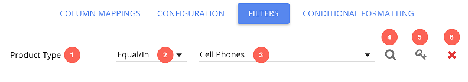

1. **Column Name:** Name of the column to filter on.
2. **Operator:** Change the operator for the filter:
	* Equal/In
	* Not Equal/In
	* > (Greater than)
	* >= (Greater than or equal to)
	* < (Less than)
	* <= (Less than or equal to)
	* Is Null
	* Is Not Null
	* Top (Ranking)
	* Bottom (Ranking)
	* Like (Accepts `%` as a wildcard character)
3. **Select Values:** Multi-select drop-down of available values for the given column. Shows 100 items only, so you need to use the advanced search if you require something outside of that list. Also features a search facility, but this too is only scanning the 100 available items.
4. **Advanced:** Opens a dialogue allowing the user to search for specific values, or change the filter to use an OBIEE variable or logical SQL.
5. **Protected:** Enables/disables protection for the filter. A protected filter will not be overridden by dashboard prompts or graph interactions.
6. **Remove:** Removes the filter.

### Advanced Filter Options

By default, the filter picklist only has 100 possible values. If the desired value is not in this list, the value can be searched for manually.

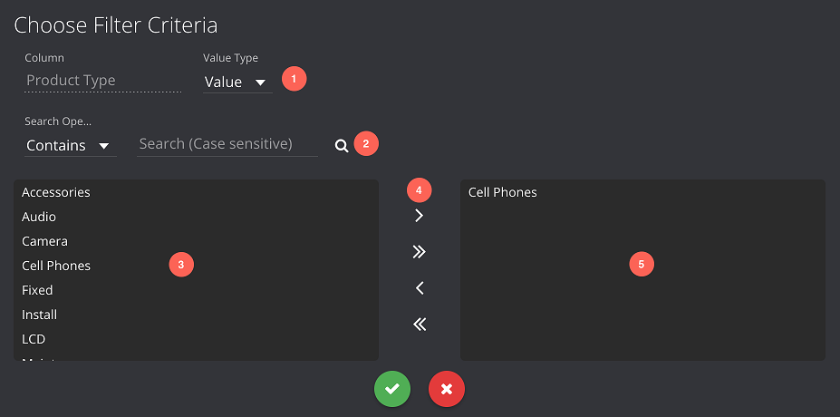

1. **Value Type:** Type of the filter value
	* Value (specific values queried through OBIEE)
	* Repository Variable (OBIEE server variable)
	* Session Variable (OBIEE user-specific variable)
	* Logical SQL (dynamically query OBIEE for the value(s))
2. **Search:** Searches for specific values via OBIEE using one of the search operators:
	* Contains
	* Starts
	* Ends
	* Is Like (`%` accepted as a wildcard)
3. **Possible Values:** Displays 100 at a time and updated by the search feature (2). Single click values to highlight them for selection.
4. **Selection Controls:** Select or deselect the highlighted values. Use the double chevron controls to select/deselect all listed values.
5. **Selected Values**

If the value type is changed to repository variable, a list of variables defined in OBIEE is shown, along with their current values.

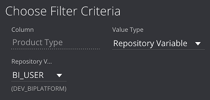

A similar interface exists for session variables as well, although some session variables may have multiple values.

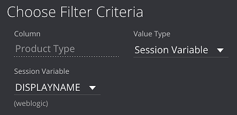

This value type provides a text area where logical SQL can be written. A full query should be specified returning one or more values, e.g.

```sql
SELECT
	"Products"."Product Type"
FROM
	"Sample Sales Lite"
WHERE
	"Products"."Product Type" IN ('Plasma', 'Audio')
```

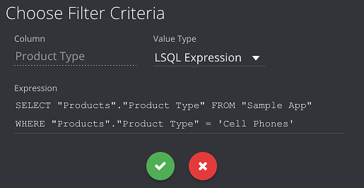

## Conditional Formatting

Several plugins allow conditional formatting and rules for this can be defined here. All of the defined formatting is shown in this list, including a brief summary of the rule and the colour change.

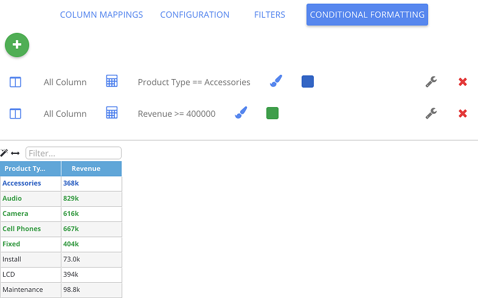

1. **Add Conditional Format:** Adds a conditional format rule and opens the edit screen.
2. **Remove:** Removes the conditional format rule.
3. **Edit:** Opens the edit screen for that format rule.

### Edit Conditional Format

A conditional format rule requires a target column to be chosen which tells the visualisation which data items it should style when the rule is true. A conditional rule also needs to be set on one of the columns. Note that the rule can be defined on a *different* column to the one that is being styled. Several plugins provide hidden column properties which can be used for formatting without being displayed in the visualisation. Finally, a colour needs to be chosen to indicate how the style should be updated. Some plugins will have their own special conditional format styling options, which is represented by a custom operator. An example of this is the heat-map formatting on pivot tables.

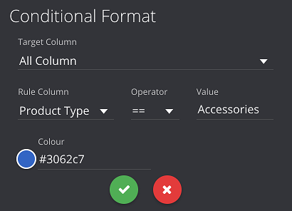

1. **Target Column:** Column in which to apply custom styling. For multiple column properties, an option to choose all of that type is available.
2. **Rule:** A conditional rule to define when the styling should be applied.
3. **Colour:** The colour to apply when the rule is true.
4. **Icon:** Some plugins (e.g. the measure tile) allow an icon as well as a colour. Choose a property name from the [FontAwesome library](https://fortawesome.github.io/Font-Awesome/icons/)

## Web Catalogue Explorer

When loading and saving visualisations in the application, the explorer window will open. This allows the user to navigate the OBIEE web catalogue where all Insights objects are stored. Any object level security defined in OBIEE is maintained, so a user will only see directories they have access to. Similarly, they may be able to read certain objects but not overwrite them.

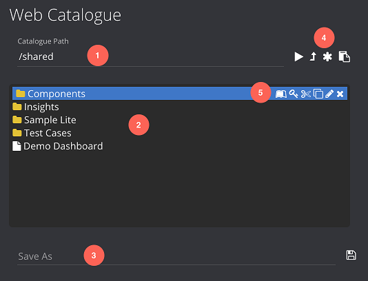

1. **Path:** Can manually type a folder path here to go straight to that location.
2. **Files and Folders:** Displays catalogue folders and any *Insights* visualisations. Vanilla OBIEE artefacts are automatically hidden. Objects can be double clicked to open them from here.
3. **Save Name:** If the explorer is in save mode, this line will be displayed and allows the user to give a name to the file before it is saved. The button to the right of this will save the file.
4. **Folder Controls**
	* Go: navigates to the path (1).
	* Folder Up: Moves up one directory.
	* New Folder: Creates a new folder and prompts for a name.
	* Paste: If any files have been cut or copied (5) to the clipboard, they can be pasted in the new location with this button.
5. **File Controls**
	* Cut: Sends the file to the clipboard for moving.
	* Copy: Sends the file to the clipboard for copying.
	* Rename
	* Delete

## Loading Options

Query string parameters can be used to set the editor to load a visualisation or dashboard page automatically, or start off in dashboard mode instead of visualisation mode.

* `path` : Expects a catalogue path to an Insights report.
* `mode` : Expects a value of `db` to automatically be in dashboard mode.

E.g.

```
/insights/app/states/visBuilder/index.html?path=/shared/Insights/Dashboard/Page 1&mode=db
```


